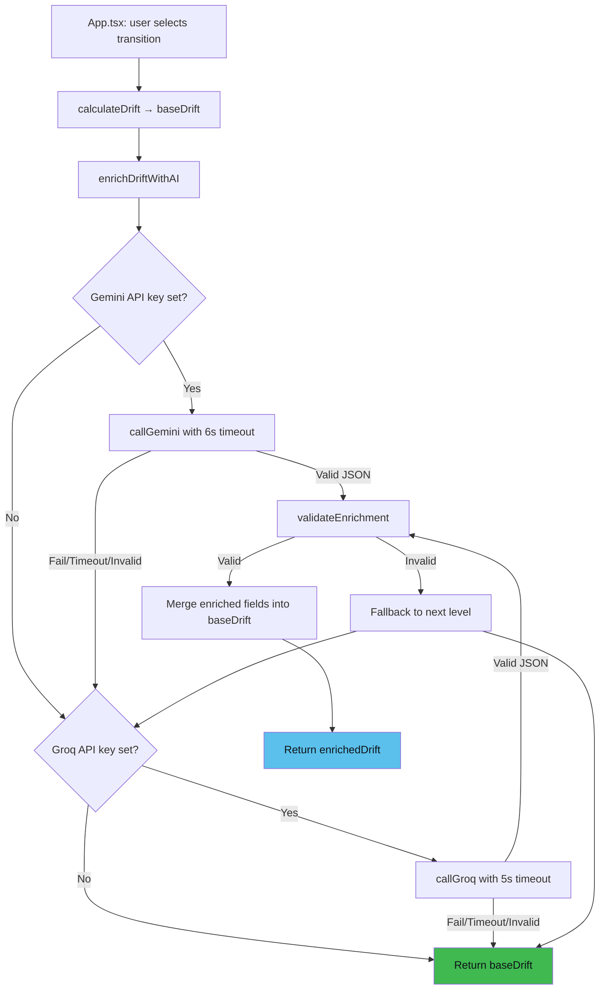
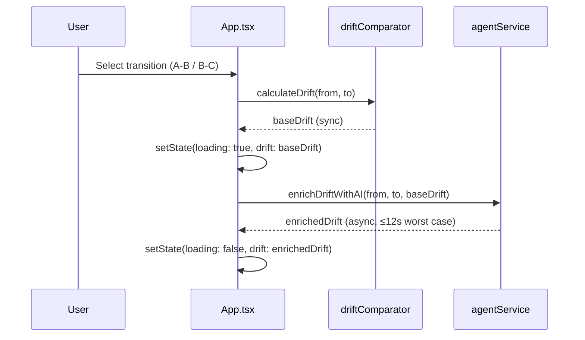

# Design Document: AI Agent Cascading Fallback

## Overview

This feature adds an AI enrichment layer to DriftBrief's existing deterministic drift analysis engine. The `agentService.ts` module implements a cascading fallback pattern (Gemini → Groq → Deterministic) that enriches three text fields (`socBriefing`, `cisoBriefing`, `urgentDecision.description`) with natural-language AI-generated content in Spanish. The architecture guarantees zero user-facing errors through graceful degradation.

The module is designed as a pure async function that takes the two snapshots plus the pre-computed `baseDrift` and returns an enriched `Drift` object (or the original on failure). The existing `Drift` interface remains unchanged.

## Architecture



### Module Boundary

```
src/services/agentService.ts
├── enrichDriftWithAI()        ← Exported: main orchestrator
├── callGemini()               ← Internal: primary provider
├── callGroq()                 ← Internal: secondary provider
├── validateEnrichment()       ← Internal: JSON structure validator
├── buildPrompt()              ← Internal: prompt construction
└── mergeEnrichment()          ← Internal: safe field merge
```

### Integration with App.tsx



## Components and Interfaces

### Exported Function

```typescript
/**
 * Attempts AI enrichment of a base drift object via cascading providers.
 * Never throws — always returns a valid Drift object.
 */
export async function enrichDriftWithAI(
  fromSnapshot: Snapshot,
  toSnapshot: Snapshot,
  baseDrift: Drift
): Promise<Drift>
```

### Internal Types

```typescript
/** Fields that AI providers enrich */
interface EnrichmentPayload {
  socBriefing: string;
  cisoBriefing: string;
  urgentDecisionDescription: string;
}

/** Result from a provider call attempt */
type ProviderResult =
  | { success: true; payload: EnrichmentPayload }
  | { success: false; reason: string };
```

### Internal Functions

```typescript
/** Constructs system + user prompts from snapshot data */
function buildPrompt(
  fromSnapshot: Snapshot,
  toSnapshot: Snapshot,
  baseDrift: Drift
): { systemPrompt: string; userPrompt: string }

/** Calls Gemini via @google/genai SDK with 6s timeout */
async function callGemini(
  systemPrompt: string,
  userPrompt: string
): Promise<ProviderResult>

/** Calls Groq via fetch to OpenAI-compatible REST API with 5s timeout */
async function callGroq(
  systemPrompt: string,
  userPrompt: string
): Promise<ProviderResult>

/** Validates that a parsed JSON object has the expected EnrichmentPayload shape */
function validateEnrichment(raw: unknown): EnrichmentPayload | null

/** Merges enrichment into baseDrift, returning new Drift object */
function mergeEnrichment(baseDrift: Drift, payload: EnrichmentPayload): Drift
```

## Data Models

### Prompt Engineering Strategy

**System Prompt** (shared across providers):

```
Eres un analista senior de ciberseguridad especializado en respuesta a incidentes.
Tu tarea es generar briefings analíticos en ESPAÑOL para un equipo de respuesta.

INSTRUCCIONES:
- Genera contenido en Markdown estructurado con headers (##) y bullet points (-)
- El tono debe ser profesional, conciso y accionable
- socBriefing: perspectiva técnica para analistas SOC (IOCs, evidencia, contención)
- cisoBriefing: perspectiva ejecutiva para CISO (riesgo, impacto negocio, decisiones)
- urgentDecisionDescription: descripción detallada de la decisión urgente pendiente

FORMATO DE RESPUESTA (JSON estricto):
{
  "socBriefing": "string con markdown",
  "cisoBriefing": "string con markdown",
  "urgentDecisionDescription": "string con markdown"
}

Responde ÚNICAMENTE con el JSON. Sin explicaciones adicionales.
```

**User Prompt** (dynamic per call):

```
CONTEXTO DEL INCIDENTE:
- Transición: Snapshot {fromId} → Snapshot {toId}
- Severidad: {from.severity} → {to.severity}
- Headline: {baseDrift.headline}

NUEVOS HECHOS CONFIRMADOS:
{newFacts formatted as bullet list}

NUEVOS IOCs:
{newIOCs formatted as bullet list}

DECISIÓN URGENTE ACTUAL:
- Título: {urgentDecision.title}
- Deadline: {urgentDecision.deadline}
- Impacto: {urgentDecision.impact}

ACCIONES RECOMENDADAS:
{recommendedActions formatted as numbered list}

Genera los tres campos de briefing basándote en este contexto.
```

### Response Parsing and Validation

The validation function performs structural checks:

1. Parse response text as JSON (catch `SyntaxError`)
2. Verify the result is a non-null object
3. Verify `socBriefing` exists and is a non-empty string
4. Verify `cisoBriefing` exists and is a non-empty string
5. Verify `urgentDecisionDescription` exists and is a non-empty string

If any check fails, return `null` (treated as provider failure).

### Timeout Implementation

- **Gemini**: Use `AbortController` with `setTimeout(6000)` passed to the SDK's request options
- **Groq**: Use `AbortController` with `setTimeout(5000)` passed to `fetch` signal

### Environment Variables

| Variable | Provider | Purpose |
|----------|----------|---------|
| `VITE_GEMINI_API_KEY` | Gemini | Google AI API key |
| `VITE_GROQ_API_KEY` | Groq | Groq API key |

Both accessed via `import.meta.env.VITE_*`.

## Correctness Properties

*A property is a characteristic or behavior that should hold true across all valid executions of a system — essentially, a formal statement about what the system should do. Properties serve as the bridge between human-readable specifications and machine-verifiable correctness guarantees.*

### Property 1: Field Preservation Invariant

*For any* valid `baseDrift` object and *any* result from `enrichDriftWithAI`, all fields of the returned Drift object except `socBriefing`, `cisoBriefing`, and `urgentDecision.description` SHALL be strictly equal (deep equality) to the corresponding fields in `baseDrift`.

**Validates: Requirements 1.2, 1.3**

### Property 2: Cascading Fallback Correctness

*For any* combination of provider availability states (Gemini success/fail, Groq success/fail), the `enrichDriftWithAI` function SHALL:
- Use Gemini's response when Gemini succeeds with valid JSON
- Use Groq's response when Gemini fails and Groq succeeds with valid JSON
- Return `baseDrift` unmodified when both providers fail

In all cases, the returned object strictly conforms to the `Drift` interface.

**Validates: Requirements 2.1, 3.1, 3.2, 4.1**

### Property 3: Total Function (Never Throws)

*For any* valid `Snapshot` pair and `baseDrift` object, and *for any* failure mode of the external providers (network error, timeout, invalid JSON, missing API key, malformed response), the `enrichDriftWithAI` function SHALL never throw an exception and SHALL always resolve to a valid `Drift` object.

**Validates: Requirements 4.1, 4.2**

### Property 4: Validation Correctness

*For any* arbitrary JSON value, the `validateEnrichment` function SHALL return a valid `EnrichmentPayload` only when the input contains non-empty string fields `socBriefing`, `cisoBriefing`, and `urgentDecisionDescription`. For all other inputs (missing fields, wrong types, null, non-objects), it SHALL return `null`.

**Validates: Requirements 5.1, 5.2, 5.3**

## Error Handling

| Failure Scenario | Handling | User Impact |
|-----------------|----------|-------------|
| Missing API key (Gemini) | Skip Gemini, try Groq | None (transparent) |
| Missing API key (Groq) | Skip Groq, return baseDrift | None (deterministic fallback) |
| Network timeout (6s/5s) | AbortController cancels, proceed to next | None (transparent) |
| HTTP error (4xx/5xx) | Catch, log warning, proceed to next | None (transparent) |
| Invalid JSON response | `validateEnrichment` returns null, proceed to next | None (transparent) |
| SDK instantiation error | Catch in try/catch, proceed to next | None (transparent) |

**Logging strategy**: Use `console.warn` with generic messages like `"[AgentService] Gemini provider failed, falling back to Groq"`. Never log API keys, full request/response bodies, or PII.

## Testing Strategy

### Unit Tests (Example-Based)

- Test `buildPrompt` generates Spanish content with expected structure
- Test `validateEnrichment` with specific valid/invalid JSON examples
- Test `mergeEnrichment` preserves non-enriched fields
- Test timeout behavior with mocked slow responses
- Test missing API key scenarios

### Property-Based Tests

Using a property-based testing library (e.g., `fast-check`), configured with minimum 100 iterations per property:

- **Property 1**: Generate random `Drift` objects, run through `mergeEnrichment`, verify field preservation invariant
- **Property 2**: Generate random provider success/failure combinations, verify cascade produces correct output
- **Property 3**: Generate random inputs with random failure injections, verify function never throws
- **Property 4**: Generate random JSON values, verify validation accepts only correctly-shaped objects

Each property test tagged with:
```
// Feature: ai-agent-cascading-fallback, Property N: [property text]
```

### Integration Tests (Example-Based)

- Test App.tsx loading state appears during async resolution
- Test App.tsx displays enriched content after resolution
- Test full cascade with mocked providers end-to-end
