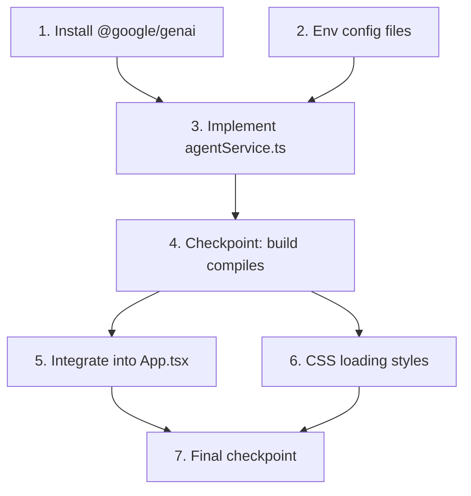

# Implementation Plan: AI Agent Cascading Fallback

## Overview

This plan implements the AI enrichment service with cascading fallback (Gemini → Groq → Deterministic) for DriftBrief. Tasks are ordered to build incrementally: dependency installation → core service module → environment config → UI integration → build verification.

## Tasks

- [x] 1. Install @google/genai dependency
  - Run `npm install @google/genai` to add the Gemini SDK as a production dependency
  - Verify `package.json` reflects the new dependency
  - _Requirements: 2.2_

- [x] 2. Create environment configuration files
  - [x] 2.1 Create `.env.example` with placeholder keys
    - Add `VITE_GEMINI_API_KEY=your_gemini_api_key_here`
    - Add `VITE_GROQ_API_KEY=your_groq_api_key_here`
    - _Requirements: 7.1, 2.4, 3.5_
  - [x] 2.2 Update `.gitignore` to exclude `.env` files
    - Add `.env` and `.env.local` entries if not already present
    - _Requirements: 7.4_

- [x] 3. Implement `src/services/agentService.ts`
  - [x] 3.1 Create the module with `buildPrompt` function
    - Implement system prompt (Spanish, JSON-only response format) and dynamic user prompt construction from Snapshot and Drift data
    - Export types `EnrichmentPayload` and `ProviderResult` internally
    - _Requirements: 1.2, 1.4_
  - [x] 3.2 Implement `validateEnrichment` function
    - Parse raw JSON and verify `socBriefing`, `cisoBriefing`, `urgentDecisionDescription` are non-empty strings
    - Return typed `EnrichmentPayload` or `null`
    - _Requirements: 5.1, 5.2, 5.3_
  - [x] 3.3 Implement `mergeEnrichment` function
    - Create new Drift object spreading baseDrift, replacing only `socBriefing`, `cisoBriefing`, and `urgentDecision.description`
    - _Requirements: 1.2, 1.3_
  - [x] 3.4 Implement `callGemini` provider function
    - Use `@google/genai` SDK with model `gemini-2.0-flash`
    - Read key from `import.meta.env.VITE_GEMINI_API_KEY`
    - Enforce 6s timeout via `AbortController`
    - Return `ProviderResult` (success with payload or failure with reason)
    - Wrap entire body in try/catch, never throw
    - _Requirements: 2.1, 2.2, 2.3, 2.4_
  - [x] 3.5 Implement `callGroq` provider function
    - Use `fetch` to `https://api.groq.com/openai/v1/chat/completions` with model `llama-3.3-70b-versatile`
    - Read key from `import.meta.env.VITE_GROQ_API_KEY`
    - Enforce 5s timeout via `AbortController`
    - Return `ProviderResult` (success with payload or failure with reason)
    - Wrap entire body in try/catch, never throw
    - _Requirements: 3.2, 3.3, 3.4, 3.5_
  - [x] 3.6 Implement `enrichDriftWithAI` orchestrator function (exported)
    - Attempt Gemini first (skip if no API key), then Groq (skip if no API key), then return baseDrift
    - Use `validateEnrichment` on each provider response before accepting
    - Use `mergeEnrichment` to produce final result
    - Log failures with `console.warn` without exposing secrets
    - Never throw — wrap in top-level try/catch returning baseDrift on any unexpected error
    - _Requirements: 1.1, 3.1, 4.1, 4.2, 4.3_

- [x] 4. Checkpoint - Verify module compiles
  - Ensure `npm run build` compiles without TypeScript errors
  - Ensure all tests pass, ask the user if questions arise.

- [x] 5. Integrate AI enrichment into App.tsx
  - [x] 5.1 Add loading state and async enrichment logic
    - Add `useState<boolean>` for `isEnriching` loading state
    - Add `useState<Drift>` for the enriched drift result
    - Add `useEffect` that calls `enrichDriftWithAI` when `fromSnapshot`/`toSnapshot` change
    - Set `isEnriching = true` before the call, `false` after resolution
    - Pass `enrichedDrift` (or baseDrift while loading) to child components
    - _Requirements: 6.1, 6.2, 1.1_
  - [x] 5.2 Add loading skeleton UI in App.tsx
    - Show loading indicator with text "Analizando telemetría y redactando briefings con IA..." while `isEnriching` is true
    - Render enriched content once resolved
    - _Requirements: 6.1, 6.2_

- [x] 6. Add CSS styles for loading indicator
  - Add skeleton/pulse animation styles to `src/App.css`
  - Use existing design tokens from `src/styles/tokens.css` (colors, spacing)
  - Style the loading message with `--color-drift` (#5BC0EB) accent
  - _Requirements: 6.1_

- [x] 7. Final checkpoint - Verify full build
  - Run `npm run build` and confirm zero TypeScript errors
  - Verify the app runs correctly with and without API keys configured
  - Ensure all tests pass, ask the user if questions arise.

## Task Dependency Graph

```json
{
  "waves": [
    { "tasks": [1, 2] },
    { "tasks": [3] },
    { "tasks": [4] },
    { "tasks": [5, 6] },
    { "tasks": [7] }
  ]
}
```



## Notes

- The `Drift` interface in `src/types/index.ts` is NOT modified — enrichment only replaces string field values
- All provider calls are wrapped in try/catch to guarantee the function never throws
- The deterministic engine (`driftComparator.ts`) continues to produce `baseDrift` synchronously — the async AI layer is additive
- API keys are optional — the app works fully without them via fallback to baseDrift
- Property tests validate correctness properties from the design document (field preservation, cascade logic, total function, validation)
