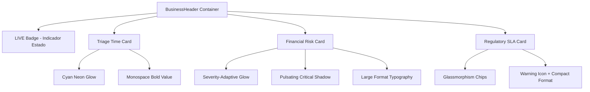
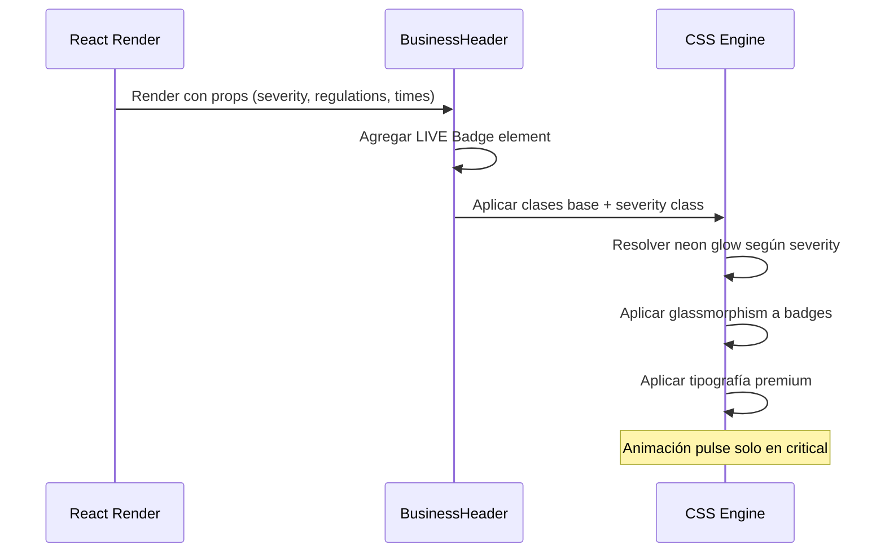

# Documento de Diseño: Business Header Cyber-Premium

## Visión General

Este diseño define el refinamiento visual CSS del componente `BusinessHeader` existente para lograr una estética "Cyber-Defense Premium". El objetivo es elevar el impacto visual del banner de métricas de negocio mediante neon glows adaptativos por severidad, glassmorphism en badges regulatorios, tipografía enfatizada y un indicador de estado "LIVE DRIFT METRICS". No se modifica lógica de negocio ni flujo de datos — solo se alteran estilos CSS y se agrega un elemento JSX mínimo para el badge LIVE.

El componente mantiene su estructura de tres secciones (Triage Time, Financial Risk, Regulatory SLA) pero cada una recibe tratamiento visual diferenciado según su función y nivel de severidad.

## Arquitectura Visual



## Flujo de Renderizado Visual



## Componentes y Clases CSS

### Componente 1: LIVE Badge (Nuevo Elemento JSX)

**Propósito**: Indicador visual de estado "en vivo" para las métricas del banner.

**Estructura JSX**:
```typescript
<div className="business-header__live-badge">
  <span className="business-header__live-dot"></span>
  LIVE DRIFT METRICS
</div>
```

**Clases CSS nuevas**:
- `.business-header__live-badge` — Contenedor del badge con tipografía monospace xs
- `.business-header__live-dot` — Círculo animado verde/cyan

### Componente 2: Neon Glow Shadows (CSS Enhancement)

**Propósito**: Sombras neón adaptativas según severidad del incidente.

**Clases CSS modificadas**:
- `.business-header__triage` — Añadir `box-shadow` cyan
- `.financial-risk--critical` — Añadir `box-shadow` rojo pulsante
- `.financial-risk--high` — Añadir `box-shadow` naranja

### Componente 3: Financial Risk Typography (CSS Enhancement)

**Propósito**: Enfatizar el valor monetario en severidad crítica con formato grande.

**Clases CSS nuevas**:
- `.financial-risk--critical .business-header__value` — `font-size: 1.8rem`, `font-weight: 700`

### Componente 4: Glassmorphism Regulatory Badges (CSS Enhancement)

**Propósito**: Transformar badges sólidos en chips glassmorphism premium.

**Clase CSS modificada**:
- `.business-header__badge` — Fondo semi-transparente, border sutil, backdrop-filter

## Modelos de Datos CSS

### Tokens Neón (Nuevos)

```css
/* Neon Glow Tokens - extender tokens.css o usar inline */
--glow-cyan: 0 0 12px rgba(91, 192, 235, 0.3);
--glow-critical: 0 0 15px rgba(248, 81, 73, 0.25);
--glow-high: 0 0 12px rgba(245, 165, 36, 0.2);
--glow-confirmed: 0 0 8px rgba(63, 185, 80, 0.3);
```

### Glassmorphism Tokens

```css
--glass-decision-bg: rgba(255, 209, 102, 0.1);
--glass-decision-border: rgba(255, 209, 102, 0.3);
```

### Animación Pulse

```css
@keyframes neon-pulse {
  0%, 100% { box-shadow: 0 0 15px rgba(248, 81, 73, 0.25); }
  50% { box-shadow: 0 0 25px rgba(248, 81, 73, 0.4); }
}
```

## Especificaciones CSS Detalladas

### LIVE Badge

```css
.business-header__live-badge {
  display: flex;
  align-items: center;
  gap: var(--spacing-xs);
  font-size: var(--font-size-xs);
  font-family: 'JetBrains Mono', 'Fira Code', monospace;
  color: var(--color-text-muted);
  text-transform: uppercase;
  letter-spacing: 0.08em;
  padding: var(--spacing-xs) var(--spacing-sm);
  background: rgba(63, 185, 80, 0.08);
  border: 1px solid rgba(63, 185, 80, 0.2);
  border-radius: var(--radius-sm);
  align-self: flex-start;
}

.business-header__live-dot {
  width: 6px;
  height: 6px;
  border-radius: 50%;
  background: var(--color-confirmed);
  box-shadow: 0 0 6px rgba(63, 185, 80, 0.6);
  animation: live-pulse 2s ease-in-out infinite;
}

@keyframes live-pulse {
  0%, 100% { opacity: 1; }
  50% { opacity: 0.4; }
}
```

### Triage Card Cyan Accent

```css
.business-header__triage {
  border-left: 3px solid var(--color-drift);
  box-shadow: var(--glow-cyan);
}

.business-header__automated {
  color: var(--color-drift);
  font-family: 'JetBrains Mono', 'Fira Code', monospace;
  font-weight: 700;
  font-size: var(--font-size-xl);
}
```

### Financial Risk Critical Emphasis

```css
.financial-risk--critical {
  border-left: 4px solid var(--color-critical);
  background: rgba(248, 81, 73, 0.12);
  box-shadow: 0 0 15px rgba(248, 81, 73, 0.25);
  animation: neon-pulse 3s ease-in-out infinite;
}

.financial-risk--critical .business-header__value {
  font-size: 1.8rem;
  font-weight: 700;
  color: var(--color-critical);
}
```

### Financial Risk High

```css
.financial-risk--high {
  border-left: 4px solid var(--color-probable);
  background: rgba(245, 165, 36, 0.12);
  box-shadow: var(--glow-high);
}
```

### Glassmorphism Regulatory Badges

```css
.business-header__badge {
  display: inline-flex;
  align-items: center;
  gap: var(--spacing-xs);
  padding: var(--spacing-xs) var(--spacing-sm);
  background: rgba(255, 209, 102, 0.1);
  color: var(--color-decision);
  border: 1px solid rgba(255, 209, 102, 0.3);
  border-radius: 999px; /* pill shape */
  font-size: var(--font-size-xs);
  font-weight: 500;
  backdrop-filter: blur(4px);
  -webkit-backdrop-filter: blur(4px);
}
```

## Formato de Texto de Badges Regulatorios

El texto del badge cambia de formato plano a formato compacto con ícono:

**Antes**: `NIS2 Alert SLA: 24h`
**Después**: `⚠️ NIS2 • 24h SLA`

Esto requiere un cambio mínimo en el JSX del mapeo de badges:

```typescript
{applicable.map((reg) => (
  <span key={reg.id} className="business-header__badge">
    ⚠️ {reg.name} • {reg.notificationDeadlineHours}h SLA
  </span>
))}
```

## Manejo de Errores

### Escenario 1: backdrop-filter no soportado

**Condición**: Navegadores legacy sin soporte para `backdrop-filter`
**Respuesta**: El badge mantiene el `background` semi-transparente como fallback visual aceptable
**Recuperación**: Degradación elegante, no se requiere acción

### Escenario 2: Fuente monospace no disponible

**Condición**: JetBrains Mono o Fira Code no cargadas
**Respuesta**: Fallback a `monospace` genérica del sistema
**Recuperación**: La tipografía genérica monospace mantiene el efecto visual deseado

## Estrategia de Testing

### Testing Visual Manual

- Verificar que cada card (Triage, Financial, Regulatory) muestra su glow correspondiente
- Verificar que la animación pulse solo aparece en severidad `critical`
- Verificar que los badges regulatorios muestran formato glassmorphism pill
- Verificar que el LIVE badge está presente y animado

### Testing de Build

- `npm run build` debe completarse sin errores TypeScript
- No deben existir warnings de accesibilidad nuevos

### Testing de Regresión

- La estructura del DOM no cambia (excepto el LIVE badge nuevo)
- Las props del componente no cambian
- Los tests existentes deben seguir pasando

## Consideraciones de Performance

- Las animaciones CSS (`neon-pulse`, `live-pulse`) usan `opacity` y `box-shadow` que no afectan layout
- `backdrop-filter: blur(4px)` es ligero pero puede impactar en dispositivos muy antiguos
- No se agregan dependencias externas ni assets adicionales

## Consideraciones de Seguridad

No aplica — este cambio es puramente visual/CSS sin interacción con datos o APIs.

## Dependencias

- **Ninguna nueva**: Se utilizan exclusivamente CSS nativo y tokens existentes del proyecto
- **Fuentes opcionales**: JetBrains Mono / Fira Code (fallback a monospace genérica)

## Correctness Properties

*Una propiedad es una característica o comportamiento que debe mantenerse verdadero en todas las ejecuciones válidas del sistema — esencialmente, una declaración formal sobre lo que el sistema debe hacer.*

### Property 1: Integridad de Build

*Para cualquier* modificación aplicada en `BusinessHeader.css` y `BusinessHeader.tsx`, el comando `npm run build` debe completarse exitosamente sin errores de compilación TypeScript ni CSS.

**Validates: Requirements 7.1, 7.2**

### Property 2: No Alteración de Lógica

*Para cualquier* conjunto de props válido pasado a `BusinessHeader`, el output funcional del componente (estructura de datos renderizada, cálculos, filtros de regulaciones) debe ser idéntico antes y después de los cambios CSS.

**Validates: Requirements 6.1, 6.2, 6.3, 6.4**

### Property 3: Correspondencia Severity-Glow

*Para cualquier* nivel de severidad (`critical`, `high`, `medium`, `low`), las clases CSS aplicadas al card Financial Risk deben corresponder exactamente al mapeo: critical→glow rojo pulsante, high→glow naranja, medium/low→sin glow especial.

**Validates: Requirements 1.2, 1.3, 1.4**
