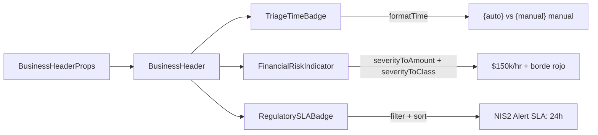

# Design Document: BusinessHeader

## Overview

El componente `BusinessHeader` es un banner visual puramente presentacional que se posiciona entre el `Header` y el `IncidentCard` en el layout principal de DriftBrief. Renderiza tres secciones de métricas de impacto de negocio:

1. **Triage_Time_Badge** — Reducción de tiempo de triage (automatizado vs manual)
2. **Financial_Risk_Indicator** — Riesgo financiero estimado por hora según severidad
3. **Regulatory_SLA_Badge** — Badges de cumplimiento regulatorio (NIS2/GDPR)

### Decisiones de Diseño

- **Props-only, sin estado**: El componente no gestiona estado interno (`useState`), no ejecuta efectos (`useEffect`) ni realiza llamadas externas. Toda la lógica es derivada de props.
- **Composición interna**: Las tres secciones se implementan como funciones internas (o sub-componentes privados) dentro del mismo archivo para mantener la cohesión y evitar exportaciones innecesarias.
- **CSS con tokens**: Los estilos usan exclusivamente variables CSS del archivo `tokens.css`, manteniendo coherencia con el design system existente.
- **Accesibilidad nativa**: Uso de `role="banner"`, `aria-label` condicional por severidad, y texto descriptivo que no depende exclusivamente del color.

## Architecture

```mermaid
graph TD
    A[App.tsx] --> B[Header]
    A --> C[BusinessHeader]
    A --> D[IncidentCard]
    
    C --> E[TriageTimeBadge]
    C --> F[FinancialRiskIndicator]
    C --> G[RegulatorySLABadge]
    
    style C fill:#1D252D,stroke:#5BC0EB,stroke-width:2px
    style E fill:#161C22,stroke:#2A333D
    style F fill:#161C22,stroke:#2A333D
    style G fill:#161C22,stroke:#2A333D
```



### Flujo de Datos



### Integración en App.tsx

El componente se insertará en el JSX de `App.tsx` entre `<Header />` y el `<main>`, pasando las props derivadas del estado actual de la aplicación:

```tsx
<Header />
<BusinessHeader
  automatedTimeSeconds={12}
  manualTimeSeconds={2700}
  severity={toSnapshot.severity}
  financialExposureUsd={severityToFinancialRisk(toSnapshot.severity)}
  regulations={applicableRegulations}
/>
<main className="app__main">
  <IncidentCard />
  ...
</main>
```

## Components and Interfaces

### Interfaz Principal: `BusinessHeaderProps`

```typescript
/**
 * Props del componente BusinessHeader.
 * Interfaz estrictamente tipada — no se permite el uso de `any`.
 */
export interface BusinessHeaderProps {
  /** Tiempo de triage automatizado en segundos */
  automatedTimeSeconds: number | null | undefined;
  /** Tiempo de análisis manual estimado en segundos */
  manualTimeSeconds: number | null | undefined;
  /** Nivel de severidad actual del incidente */
  severity: SeverityLevel;
  /** Exposición financiera estimada en USD por hora */
  financialExposureUsd: number | null | undefined;
  /** Lista de regulaciones aplicables al incidente */
  regulations: Regulation[];
}
```

### Componente: `BusinessHeader`

```typescript
/**
 * Banner de métricas de impacto de negocio para el dashboard de DriftBrief.
 * Componente puramente presentacional sin estado interno ni efectos secundarios.
 * @param props - Datos de métricas tipados según BusinessHeaderProps
 * @returns Elemento JSX del banner con tres secciones de métricas
 */
export function BusinessHeader(props: BusinessHeaderProps): JSX.Element;
```

### Funciones Auxiliares Internas

```typescript
/**
 * Convierte un valor en segundos a formato legible.
 * Valores < 60 → "{N}s", valores >= 60 → "{Math.round(N/60)}m"
 * @param seconds - Valor numérico en segundos
 * @returns Cadena formateada con unidad
 */
function formatTime(seconds: number): string;

/**
 * Mapea un SeverityLevel a su clase CSS de estilo de alerta.
 * critical → "financial-risk--critical"
 * high → "financial-risk--high"
 * medium | low → "" (sin clase de énfasis)
 * @param severity - Nivel de severidad
 * @returns Nombre de clase CSS o cadena vacía
 */
function severityToClassName(severity: SeverityLevel): string;

/**
 * Filtra regulaciones con notificationDeadlineHours válido (no null)
 * y las ordena por urgencia ascendente (menor deadline primero).
 * @param regulations - Lista de regulaciones
 * @returns Lista filtrada y ordenada
 */
function getApplicableRegulations(regulations: Regulation[]): Regulation[];
```

### Estructura DOM Esperada

```html
<section class="business-header" role="banner">
  <!-- Triage Time Badge -->
  <div class="business-header__metric business-header__triage">
    <span class="business-header__label">Triage Time</span>
    <span class="business-header__value">
      ⏱️ <span class="business-header__automated">12s</span> vs 45m manual
    </span>
  </div>

  <!-- Financial Risk Indicator -->
  <div class="business-header__metric business-header__financial financial-risk--critical"
       aria-label="Riesgo financiero: severidad critical">
    <span class="business-header__label">Financial Risk</span>
    <span class="business-header__value">$150k/hr</span>
  </div>

  <!-- Regulatory SLA Badges -->
  <div class="business-header__metric business-header__regulatory">
    <span class="business-header__label">Regulatory SLA</span>
    <div class="business-header__badges">
      <span class="business-header__badge">NIS2 Alert SLA: 24h</span>
      <span class="business-header__badge">GDPR Alert SLA: 72h</span>
    </div>
  </div>
</section>
```

## Data Models

### Mapeo Severidad → Riesgo Financiero

| SeverityLevel | Valor Monetario | Clase CSS | Borde | aria-label |
|---|---|---|---|---|
| `critical` | `$150k/hr` | `financial-risk--critical` | 4px solid var(--color-critical) | "Riesgo financiero: severidad critical" |
| `high` | `$50k/hr` | `financial-risk--high` | 4px solid var(--color-probable) | "Riesgo financiero: severidad high" |
| `medium` | `$10k/hr` | (ninguna) | var(--color-border-subtle) | (ninguno) |
| `low` | `$0/hr` | (ninguna) | var(--color-border-subtle) | (ninguno) |

### Lógica de Formato de Tiempo

| Entrada (segundos) | Salida |
|---|---|
| `12` | `"12s"` |
| `59` | `"59s"` |
| `60` | `"1m"` |
| `90` | `"2m"` (redondeado) |
| `2700` | `"45m"` |
| `0` | (no renderiza — retorna null) |
| `-5` | (no renderiza — retorna null) |
| `undefined` | (no renderiza — retorna null) |

### Lógica de Filtrado y Orden de Regulaciones

```typescript
// Entrada ejemplo:
const regulations: Regulation[] = [
  { id: 'gdpr', name: 'GDPR', notificationDeadlineHours: 72, ... },
  { id: 'nis2', name: 'NIS2', notificationDeadlineHours: 24, ... },
  { id: 'hipaa', name: 'HIPAA', notificationDeadlineHours: null, ... },
];

// Resultado filtrado y ordenado:
// [NIS2 (24h), GDPR (72h)] — HIPAA excluido por deadline null
```

### Estilos CSS (tokens.css + BusinessHeader.css)

```css
/* src/components/BusinessHeader.css */
.business-header {
  display: flex;
  gap: var(--spacing-lg);
  padding: var(--spacing-md) var(--spacing-lg);
  background: var(--color-surface);
  border: 1px solid var(--color-border-subtle);
  border-radius: var(--radius-md);
  margin-bottom: var(--spacing-md);
}

.business-header__metric {
  flex: 1;
  display: flex;
  flex-direction: column;
  gap: var(--spacing-xs);
  padding: var(--spacing-sm) var(--spacing-md);
  border-radius: var(--radius-sm);
}

.business-header__label {
  font-size: var(--font-size-xs);
  color: var(--color-text-muted);
  text-transform: uppercase;
  letter-spacing: 0.05em;
}

.business-header__value {
  font-size: var(--font-size-lg);
  color: var(--color-text-primary);
  font-weight: 600;
}

.business-header__automated {
  color: var(--color-drift);
}

/* Financial Risk - Severity Variants */
.financial-risk--critical {
  border-left: 4px solid var(--color-critical);
  background: rgba(248, 81, 73, 0.12);
}

.financial-risk--high {
  border-left: 4px solid var(--color-probable);
  background: rgba(245, 165, 36, 0.12);
}

/* Regulatory Badge */
.business-header__badge {
  display: inline-block;
  padding: var(--spacing-xs) var(--spacing-sm);
  background: var(--color-decision);
  color: #0F1318;
  border-radius: var(--radius-sm);
  font-size: var(--font-size-xs);
  font-weight: 600;
  margin-right: var(--spacing-xs);
}
```

## Correctness Properties

*Una propiedad es una característica o comportamiento que debe mantenerse verdadero en todas las ejecuciones válidas de un sistema — esencialmente, una declaración formal sobre lo que el sistema debe hacer. Las propiedades sirven como puente entre especificaciones legibles por humanos y garantías de correctitud verificables por máquina.*

### Property 1: Formato de tiempo respeta el umbral de 60 segundos

*Para cualquier* número positivo `n` recibido como prop de tiempo, si `n < 60` el texto renderizado SHALL contener `"{n}s"`, y si `n >= 60` el texto renderizado SHALL contener `"{Math.round(n/60)}m"`.

**Validates: Requirements 4.1**

### Property 2: Valores de tiempo inválidos producen renderizado nulo

*Para cualquier* valor de `automatedTimeSeconds` o `manualTimeSeconds` que sea `<= 0`, `null` o `undefined`, el componente Triage_Time_Badge SHALL retornar `null` y no producir elementos visibles en el DOM.

**Validates: Requirements 4.4**

### Property 3: Resiliencia ante props ausentes

*Para cualquier* combinación de props donde `financialExposureUsd` sea `null` o `undefined`, el componente SHALL renderizar el placeholder "—" en la posición correspondiente sin lanzar excepciones, y las demás secciones del banner SHALL permanecer visibles y funcionales.

**Validates: Requirements 1.5, 6.2**

### Property 4: Formato de badge regulatorio

*Para cualquier* objeto `Regulation` con `notificationDeadlineHours` distinto de null, el texto renderizado del badge SHALL coincidir exactamente con el patrón `"{name} Alert SLA: {notificationDeadlineHours}h"`.

**Validates: Requirements 2.3, 5.1**

### Property 5: Filtrado y orden de badges regulatorios por urgencia

*Para cualquier* array de objetos `Regulation`, solo aquellas con `notificationDeadlineHours` no nulo SHALL generar badges visibles, y dichos badges SHALL estar ordenados de menor a mayor `notificationDeadlineHours` (regulación más urgente primero).

**Validates: Requirements 5.1, 5.2**

### Property 6: Atributo role="banner" siempre presente

*Para cualquier* conjunto válido de props (completas, parciales o con valores nulos), el elemento contenedor del BusinessHeader SHALL siempre incluir el atributo `role="banner"`.

**Validates: Requirements 1.6**

### Property 7: aria-label de severidad para niveles críticos

*Para cualquier* valor de `severity` en `{critical, high}`, el Financial_Risk_Indicator SHALL incluir un atributo `aria-label` que contenga el nombre del nivel de severidad actual. *Para cualquier* valor de `severity` en `{medium, low}`, el atributo `aria-label` de severidad SHALL estar ausente o no contener una indicación de alerta.

**Validates: Requirements 3.5**

## Error Handling

### Estrategia de Resiliencia

| Escenario | Comportamiento | Resultado Visual |
|---|---|---|
| `automatedTimeSeconds` es null/undefined/<=0 | TriageTimeBadge retorna `null` | Sección de triage no visible |
| `manualTimeSeconds` es null/undefined/<=0 | TriageTimeBadge retorna `null` | Sección de triage no visible |
| `financialExposureUsd` es null/undefined | Renderiza placeholder "—" | Texto "—" en posición de métrica |
| `regulations` es array vacío | RegulatorySLABadge retorna `null` | Sección regulatoria no visible |
| Todas las regulaciones tienen `notificationDeadlineHours: null` | RegulatorySLABadge retorna `null` | Sección regulatoria no visible |
| `severity` es un valor válido pero inesperado en futuro | Estilo por defecto (sin borde de énfasis) | Renderizado neutral |

### Principios de Error

1. **Nunca lanzar excepciones en renderizado**: Todas las props nullable se manejan con guardas condicionales antes del JSX.
2. **Degradación parcial**: Si una sección no puede renderizarse (datos insuficientes), las demás secciones permanecen visibles.
3. **Sin dangerouslySetInnerHTML**: Todo texto dinámico se inserta mediante interpolación JSX estándar de React, eliminando vectores XSS.
4. **TypeScript como primera línea de defensa**: La interfaz `BusinessHeaderProps` con tipos estrictos previene errores en tiempo de compilación.

## Testing Strategy

### Testing Basado en Propiedades (PBT)

**Librería**: [fast-check](https://github.com/dubzzz/fast-check) v4.x (ya instalada en el proyecto).

**Configuración**:
- Mínimo 100 iteraciones por propiedad
- Cada test referencia su propiedad del documento de diseño
- Formato de tag: `Feature: business-header, Property {N}: {título}`

**Tests de propiedades cubren**:
- Formato de tiempo con umbral de 60s (Propiedad 1)
- Valores inválidos de tiempo → renderizado nulo (Propiedad 2)
- Resiliencia ante props ausentes / placeholder (Propiedad 3)
- Formato correcto de badge regulatorio (Propiedad 4)
- Filtrado y ordenamiento de regulaciones por urgencia (Propiedad 5)
- Atributo role="banner" siempre presente (Propiedad 6)
- aria-label condicional por severidad (Propiedad 7)

### Tests Unitarios (Basados en Ejemplos)

- Mapeo severidad → valor monetario: critical=$150k/hr, high=$50k/hr, medium=$10k/hr, low=$0/hr (Req 2.2)
- Clase CSS aplicada para cada nivel de severidad (Reqs 3.1, 3.2, 3.3)
- Emoji ⏱️ presente en TriageTimeBadge (Req 4.2)
- Color `var(--color-drift)` aplicado al valor automatizado (Req 4.2)
- Color `var(--color-decision)` aplicado al fondo del badge regulatorio (Req 5.4)
- Array vacío de regulaciones → no renderiza badges (Req 5.3)
- Cambio de severidad actualiza estilos sin recargar (Req 3.4)

### Tests de Integración

- BusinessHeader se renderiza entre Header e IncidentCard en App.tsx (Req 1.1)
- Cambio de transición en SnapshotSelector actualiza props del BusinessHeader (Req 2.1)
- Compilación TypeScript exitosa sin uso de `any` en BusinessHeaderProps (Req 6.4, 6.5)

### Estructura de Archivos de Test

```
src/components/__tests__/
├── BusinessHeader.test.tsx              # Tests unitarios (ejemplos)
└── BusinessHeader.property.test.tsx     # Tests PBT (propiedades 1-7)
```

### Generadores fast-check para PBT

```typescript
// Generador de tiempo en segundos (positivo)
const positiveSeconds = fc.integer({ min: 1, max: 86400 });

// Generador de tiempo inválido
const invalidTime = fc.oneof(
  fc.constant(0),
  fc.integer({ min: -10000, max: 0 }),
  fc.constant(null),
  fc.constant(undefined)
);

// Generador de SeverityLevel
const severityArb = fc.constantFrom('low', 'medium', 'high', 'critical');

// Generador de Regulation con deadline válido
const regulationWithDeadline = fc.record({
  id: fc.string({ minLength: 1, maxLength: 10 }),
  name: fc.string({ minLength: 1, maxLength: 20 }),
  notificationDeadlineHours: fc.integer({ min: 1, max: 720 }),
  // ... demás campos requeridos por la interfaz
});

// Generador de Regulation con deadline null
const regulationNullDeadline = fc.record({
  id: fc.string({ minLength: 1, maxLength: 10 }),
  name: fc.string({ minLength: 1, maxLength: 20 }),
  notificationDeadlineHours: fc.constant(null),
  // ... demás campos
});
```
