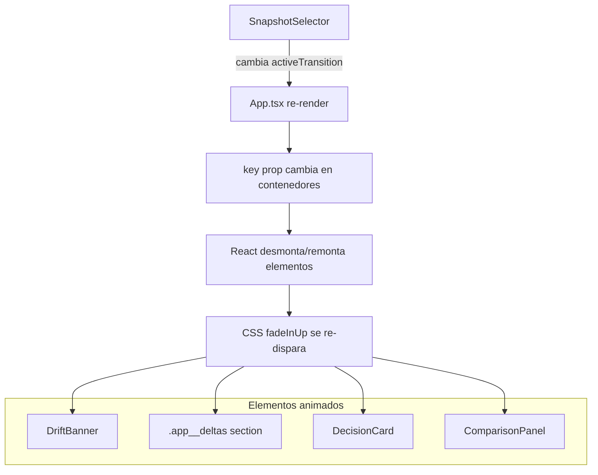

# Documento de Diseño — Drift Delta Animations

## Resumen

Esta feature introduce micro-animaciones CSS de entrada (`fadeInUp`) a los paneles de resultados de drift. El mecanismo es simple: se define un nuevo `@keyframes fadeInUp` en `App.css`, se aplica mediante una clase utilitaria `.drift-animate-in`, y se utiliza el prop `key` de React (vinculado a `activeTransition`) para forzar el remontaje de los componentes y re-disparar la animación cada vez que el usuario cambia de transición.

No se modifica lógica de negocio, props de componentes ni flujo de datos. Los cambios se limitan exclusivamente a CSS y adición de `key` props en `App.tsx`.

## Arquitectura



La arquitectura no introduce nuevas capas ni componentes. Se aprovecha el ciclo de vida existente de React (`key` → remontaje) para re-disparar animaciones CSS puras sin JavaScript adicional.

## Componentes e Interfaces

### Cambios en `src/App.css`

**Nuevo keyframe:**

```css
@keyframes fadeInUp {
  from {
    opacity: 0;
    transform: translateY(12px);
  }
  to {
    opacity: 1;
    transform: translateY(0);
  }
}
```

**Nueva clase utilitaria:**

```css
.drift-animate-in {
  animation: fadeInUp 0.4s ease-out forwards;
}
```

Ubicación: junto a los keyframes existentes (`fadeIn`, `smoothTabIn`, `pulse`, `urgencyPulse`) en `App.css`.

### Cambios en `src/App.tsx`

Se agregan props `key` basados en `activeTransition` a los contenedores animados:

| Componente | Estrategia de key |
|---|---|
| `<DriftBanner>` | Envolver en `<div key={activeTransition} className="drift-animate-in">` |
| `<section className="app__deltas">` | Agregar `key={activeTransition}` y clase `drift-animate-in` |
| `<DecisionCard>` | Envolver en `<div key={activeTransition} className="drift-animate-in">` |
| `<ComparisonPanel>` | Cambiar key existente a `` key={`${activeTransition}-${activeRole}`} `` (ya tiene `smoothTabIn` en CSS, se agrega también `drift-animate-in` al wrapper de Suspense o directamente en el CSS del `.comparison-panel`) |

### Decisiones de diseño

1. **Clase utilitaria vs selectores directos**: Se usa `.drift-animate-in` como clase utilitaria para aplicar la animación de forma explícita y reutilizable, en vez de inyectar `animation` directamente en los selectores existentes (`.drift-banner`, `.decision-card`, etc.). Esto evita conflictos con otras animaciones ya definidas (como `smoothTabIn` en `.comparison-panel`).

2. **`forwards` en fill-mode**: Se usa `animation-fill-mode: forwards` para que el elemento mantenga su estado final (`opacity: 1`) después de completar la animación. Sin esto, el elemento podría parpadear al `opacity: 0` inicial antes de estabilizarse.

3. **12px de translateY**: Se eligió 12px como distancia de desplazamiento para ser más perceptible que los keyframes existentes (`fadeIn` usa 4px, `smoothTabIn` usa 6px) pero sin ser excesivamente agresivo.

4. **Key prop como trigger**: React desmonta y remonta completamente un elemento cuando su `key` cambia. Esto re-dispara cualquier animación CSS definida en el elemento, sin necesidad de estados adicionales, `useEffect`, ni lógica imperativa.

5. **ComparisonPanel key compuesto**: El `ComparisonPanel` necesita re-animarse tanto cuando cambia `activeTransition` como cuando cambia `activeRole`, por lo que su key combina ambos valores.

## Modelo de Datos

No se introducen nuevos modelos de datos. La feature opera exclusivamente sobre:

- `activeTransition: TransitionId` — estado existente que se usa como valor del prop `key`
- `activeRole: UserRole` — estado existente que se combina en el key del `ComparisonPanel`

## Manejo de Errores

No aplica. Las animaciones CSS son puramente visuales y no generan errores en tiempo de ejecución. Si el navegador no soporta `@keyframes` o `transform`, los elementos simplemente aparecen sin animación (degradación graceful nativa de CSS).

## Estrategia de Testing

### Por qué NO se aplica Property-Based Testing

Esta feature es exclusivamente de **UI rendering y animación CSS**. No hay:
- Funciones puras con entrada/salida
- Transformaciones de datos
- Lógica de negocio
- Propiedades universales que testear con inputs variados

Las animaciones CSS no son computables ni verificables programáticamente de forma significativa con PBT.

### Estrategia de verificación

1. **Build exitoso**: Ejecutar `npm run build` para confirmar que no se introducen errores de TypeScript tras agregar los `key` props y wrappers.

2. **Verificación visual manual**: Confirmar en el navegador que:
   - Al cambiar de transición A→B a B→C, los cuatro paneles se animan con fade+slide desde abajo
   - La animación dura ~400ms y se percibe fluida
   - No hay parpadeos ni saltos visuales

3. **Verificación de no regresión**: Confirmar que:
   - Los datos mostrados son correctos tras la animación
   - El `ComparisonPanel` se re-anima también al cambiar de rol
   - No se alteran props ni comportamiento funcional existente
