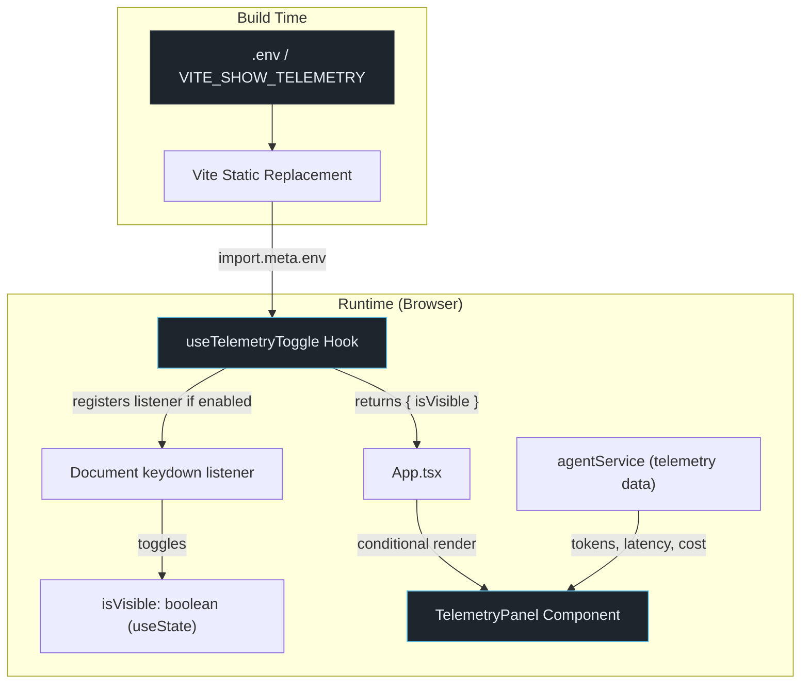

# Design Document: Hidden Telemetry Panel

## Overview

The Hidden Telemetry Panel implements a dual-gate debug mechanism for DriftBrief that displays internal AI performance metrics (tokens consumed, API latency, and estimated cost) exclusively for developers. The panel is protected by two independent conditions that must both be satisfied:

1. **Environment Gate**: The Vite build-time variable `VITE_SHOW_TELEMETRY` must be set to the case-sensitive string `"true"`.
2. **Keyboard Toggle**: The user must press `Ctrl+Shift+D` (Windows/Linux) or `Cmd+Shift+D` (macOS) to activate visibility.

This architecture ensures zero information exposure in production builds (where the env var is absent) and zero accidental exposure during development (where the toggle defaults to `false` on every page load).

### Design Rationale

- **Build-time elimination**: Vite statically replaces `import.meta.env.VITE_SHOW_TELEMETRY` at build time. When absent, the dead-code path is tree-shaken, meaning no telemetry-related UI entry points exist in production bundles.
- **No persistence**: Visibility state is ephemeral (React state only), never persisted to localStorage or sessionStorage, preventing accidental leaks across sessions.
- **Separation of concerns**: A custom hook (`useTelemetryToggle`) encapsulates all toggle logic, making it independently testable and decoupled from the panel UI.

## Architecture



### Key Architectural Decisions

| Decision | Choice | Rationale |
|----------|--------|-----------|
| State management | Local `useState` in hook | No global state needed; visibility is session-scoped and component-local |
| Event listener scope | `document` level | Keyboard shortcut must work regardless of focus location |
| Platform detection | `navigator.userAgent` check for macOS | Standard approach for modifier key differentiation |
| Data source | Read from `agentService` response metadata | Avoids duplicating API call logic; telemetry is a side-effect of existing drift computation |
| Env var read timing | Once on hook mount | Aligns with Vite static replacement; value cannot change at runtime |

## Components and Interfaces

### 1. `useTelemetryToggle` Hook (`src/hooks/useTelemetryToggle.ts`)

```typescript
/**
 * Return type for the useTelemetryToggle hook.
 */
export interface UseTelemetryToggleResult {
  /** Whether the telemetry panel should be visible */
  isVisible: boolean;
}

/**
 * Custom hook that encapsulates telemetry panel visibility logic.
 * Implements the dual-gate mechanism: env var check + keyboard toggle.
 *
 * @returns Object with isVisible boolean state
 */
export function useTelemetryToggle(): UseTelemetryToggleResult;
```

**Internal behavior:**
1. On mount, read `import.meta.env.VITE_SHOW_TELEMETRY` and store as `isEnabled` (constant for lifetime).
2. If `isEnabled` is `false`, return `{ isVisible: false }` without registering any listener.
3. If `isEnabled` is `true`:
   - Initialize `isVisible` state to `false`.
   - Detect platform via `navigator.userAgent` (check for "Mac" substring).
   - Register a `keydown` listener on `document` that checks:
     - `event.key === 'D'` or `event.key === 'd'`
     - `event.shiftKey === true`
     - Platform-appropriate modifier: `event.metaKey` (macOS) or `event.ctrlKey` (Windows/Linux)
   - On match, call `setIsVisible(prev => !prev)` and `event.preventDefault()`.
   - Return cleanup function that removes the listener.

### 2. `TelemetryPanel` Component (`src/components/TelemetryPanel.tsx`)

```typescript
export interface TelemetryData {
  /** Number of tokens consumed in the last agent call */
  tokensConsumed: number | null;
  /** API response latency in milliseconds */
  latencyMs: number | null;
  /** Estimated cost in USD (up to 4 decimal places) */
  estimatedCost: number | null;
}

export interface TelemetryPanelProps {
  /** Telemetry metrics to display */
  data: TelemetryData;
}

/**
 * Debug panel that renders AI performance metrics.
 * Only mounted when both environment gate and visibility toggle are active.
 */
export function TelemetryPanel(props: TelemetryPanelProps): JSX.Element;
```

**Rendering behavior:**
- Displays each metric with a label and formatted value.
- For `null` values, renders a placeholder indicator (`—` or a "No data" badge).
- Uses existing design tokens for styling (surface-elevated background, drift color for headers).
- Positioned as a fixed/absolute overlay at the bottom-right of the viewport to avoid disrupting the main layout.

### 3. Integration in `App.tsx`

```typescript
// In App.tsx
import { useTelemetryToggle } from './hooks/useTelemetryToggle';
// Lazy-load TelemetryPanel to keep it out of the critical path
const TelemetryPanel = lazy(() => import('./components/TelemetryPanel').then(m => ({ default: m.TelemetryPanel })));

// Inside App component:
const { isVisible } = useTelemetryToggle();
const telemetryEnabled = import.meta.env.VITE_SHOW_TELEMETRY === 'true';

// Dual-gate rendering:
{telemetryEnabled && isVisible && (
  <Suspense fallback={null}>
    <TelemetryPanel data={telemetryData} />
  </Suspense>
)}
```

### 4. Telemetry Data Flow

The `agentService` already computes drift via API calls. Telemetry data (tokens, latency, cost) will be captured as metadata from those API responses and exposed through the existing `AgentDriftResult` interface extension:

```typescript
/** Extended result including telemetry metadata */
export interface AgentDriftResult {
  drift: Drift;
  source: DriftSource;
  fallbackReason?: string;
  /** Telemetry data from the last API call (null if local fallback) */
  telemetry?: TelemetryData;
}
```

The `useAgentDrift` hook will forward this `telemetry` field to `App.tsx`, which passes it to the `TelemetryPanel`.

## Data Models

### TelemetryData

| Field | Type | Description |
|-------|------|-------------|
| `tokensConsumed` | `number \| null` | Total tokens used in the agent request (prompt + completion). `null` when using local fallback. |
| `latencyMs` | `number \| null` | Round-trip time in milliseconds from request sent to response received. `null` when using local fallback. |
| `estimatedCost` | `number \| null` | Estimated USD cost based on token count and model pricing. Up to 4 decimal places. `null` when using local fallback. |

### UseTelemetryToggleResult

| Field | Type | Description |
|-------|------|-------------|
| `isVisible` | `boolean` | Current visibility state. Always `false` if env gate is disabled. Toggles on keyboard shortcut when enabled. |

### Environment Gate Values

| `VITE_SHOW_TELEMETRY` value | Behavior |
|------------------------------|----------|
| `"true"` (exact, lowercase) | Hook registers listener, toggle is functional |
| `"True"`, `"TRUE"`, `"1"` | Treated as disabled — no listener, no panel |
| `undefined` (absent) | Treated as disabled — no listener, no panel |
| `""` (empty string) | Treated as disabled — no listener, no panel |

## Correctness Properties

*A property is a characteristic or behavior that should hold true across all valid executions of a system — essentially, a formal statement about what the system should do. Properties serve as the bridge between human-readable specifications and machine-verifiable correctness guarantees.*

### Property 1: Strict Environment Gate Validation

*For any* string value of `VITE_SHOW_TELEMETRY` (including undefined, empty string, mixed-case variants like "True", "TRUE", "1", or arbitrary strings), the telemetry system SHALL be enabled if and only if the value is exactly the case-sensitive string `"true"`. When disabled, the hook SHALL return `isVisible: false` and SHALL NOT register any keyboard event listeners.

**Validates: Requirements 1.1, 1.2, 2.3, 4.2, 5.4, 5.5**

### Property 2: Keyboard Event Discrimination

*For any* keyboard event with arbitrary combinations of `key`, `shiftKey`, `ctrlKey`, and `metaKey` values on any platform (macOS or non-macOS), the hook SHALL toggle the visibility state if and only if: `key` is `"d"` (case-insensitive), `shiftKey` is `true`, AND the platform-appropriate modifier is active (`metaKey` on macOS, `ctrlKey` on Windows/Linux). All other key combinations SHALL produce no state change.

**Validates: Requirements 2.1, 2.2, 2.4**

### Property 3: Toggle Alternation Sequence

*For any* sequence of N valid keyboard shortcut activations (where the environment gate is enabled), the resulting `isVisible` state SHALL equal `N % 2 === 1` (i.e., odd number of presses → visible, even number → hidden). The initial state is always `false`.

**Validates: Requirements 5.2, 2.1, 2.2**

### Property 4: Visibility State Independence

*For any* sequence of application state changes (role switches between SOC/CISO, snapshot transition changes between A-B/B-C), the `isVisible` state SHALL remain unchanged from its value prior to the state change sequence. External app state mutations do not affect telemetry visibility.

**Validates: Requirements 3.3**

### Property 5: Telemetry Data Rendering Completeness

*For any* `TelemetryData` object with an arbitrary combination of `null` and non-null values for `tokensConsumed`, `latencyMs`, and `estimatedCost`, the TelemetryPanel SHALL render: formatted numeric values for each non-null field (integer for tokens, milliseconds for latency, up to 4 decimal places for cost) and a placeholder indicator for each null field. No field SHALL be rendered as empty or with stale data.

**Validates: Requirements 4.1, 4.5**

## Error Handling

### Missing Telemetry Data

When the `agentService` uses the local deterministic fallback (no API call made), telemetry data is `null` for all fields. The panel displays placeholder indicators (`—`) for each metric without error states or console warnings.

### Hook Initialization Edge Cases

| Scenario | Behavior |
|----------|----------|
| `import.meta.env.VITE_SHOW_TELEMETRY` is `undefined` | Hook treats as disabled, returns `{ isVisible: false }` |
| `navigator.userAgent` is empty or unusual | Falls back to `ctrlKey` check (non-macOS behavior) |
| Multiple rapid key presses | Each valid press toggles state; React batching handles rapid state updates |
| Component unmounts during key press | Cleanup function removes listener; no state update on unmounted component |

### Console Output Suppression

When the environment gate is disabled (`VITE_SHOW_TELEMETRY !== "true"`):
- No telemetry data (tokens, latency, cost) is output to any console method (`log`, `warn`, `error`, `debug`, `info`).
- No DOM elements related to the telemetry panel are created.
- No `keydown` event listeners are registered.

## Testing Strategy

### Property-Based Tests (fast-check)

The project already uses `fast-check` (v4.9.0) and `vitest` (v4.1.10). Property-based tests will validate the 5 correctness properties defined above.

**Configuration:**
- Minimum **100 iterations** per property test
- Test file: `src/hooks/__tests__/useTelemetryToggle.property.test.ts`
- Each test tagged with: `Feature: hidden-telemetry-panel, Property {N}: {title}`

**Property test strategy:**
1. **Property 1 (Env Gate)**: Generate arbitrary strings with `fc.oneof(fc.constant("true"), fc.constant("True"), fc.constant("TRUE"), fc.constant("1"), fc.constant(""), fc.constant(undefined), fc.string())`. Assert only `"true"` enables the system.
2. **Property 2 (Keyboard Discrimination)**: Generate random `KeyboardEvent`-like objects with `fc.record({ key: fc.string(), shiftKey: fc.boolean(), ctrlKey: fc.boolean(), metaKey: fc.boolean() })` and a platform boolean. Assert only the correct combination triggers toggle.
3. **Property 3 (Toggle Alternation)**: Generate `fc.nat({ max: 50 })` for press count. Assert final state matches parity.
4. **Property 4 (State Independence)**: Generate sequences of role/transition changes via `fc.array(fc.oneof(fc.constant('soc'), fc.constant('ciso'), fc.constant('A-B'), fc.constant('B-C')))`. Assert visibility unchanged.
5. **Property 5 (Rendering Completeness)**: Generate `TelemetryData` with `fc.record({ tokensConsumed: fc.option(fc.nat()), latencyMs: fc.option(fc.nat()), estimatedCost: fc.option(fc.float()) })`. Assert correct formatting/placeholders.

### Unit Tests (Example-Based)

Test file: `src/hooks/__tests__/useTelemetryToggle.test.ts`

| Test Case | Validates |
|-----------|-----------|
| Hook initializes `isVisible` to `false` when gate is enabled | Req 2.5, 3.1 |
| Hook registers `keydown` listener on mount, removes on unmount | Req 5.3, 2.4 |
| Hook does NOT register listener when gate is disabled | Req 5.5 |
| No console output with telemetry data when gate is disabled | Req 6.1, 6.3 |
| No localStorage/sessionStorage reads on mount | Req 3.4 |

### Integration / Smoke Tests

| Test Case | Validates |
|-----------|-----------|
| `.env.example` contains `VITE_SHOW_TELEMETRY` documentation | Req 1.3 |
| `.gitignore` excludes `.env`, `.env.local`, `.env.*.local` | Req 6.2 |
| Production build without env var contains no telemetry entry points | Req 6.4 |

