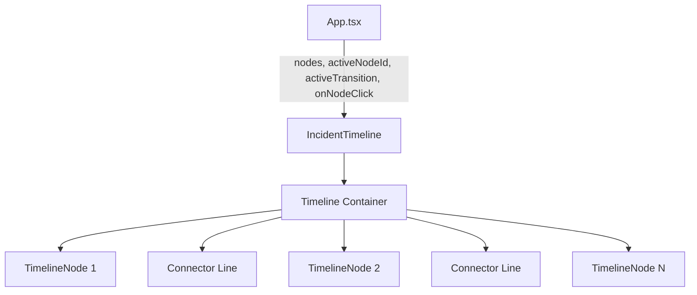
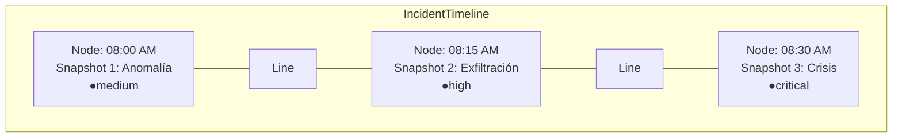
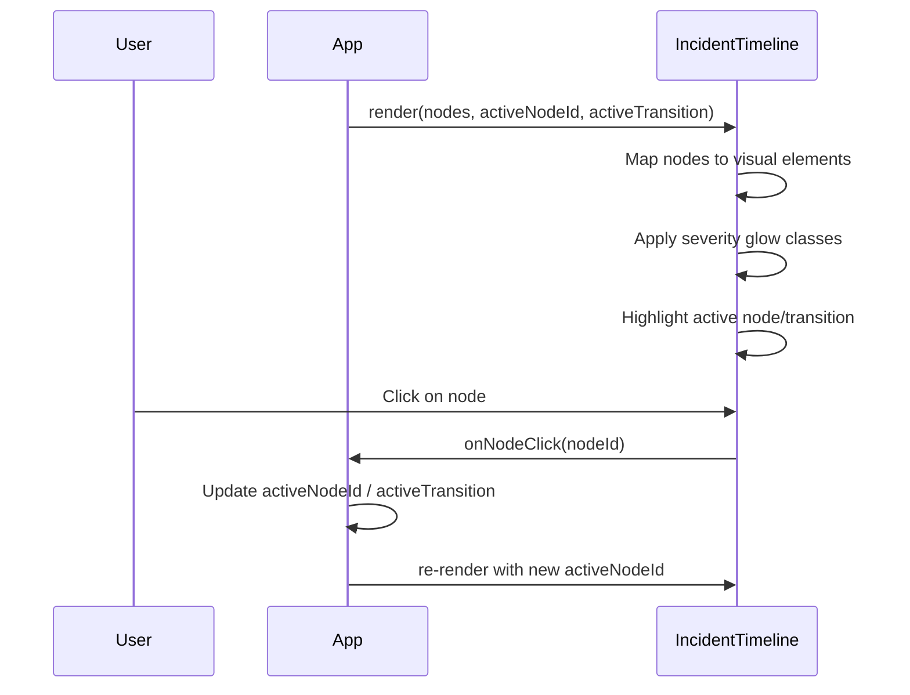

# Design Document: Incident Timeline

## Overview

The `IncidentTimeline` component visualizes the chronological progression of an active cybersecurity incident as a horizontal connected node graph. Each node represents a snapshot in time, displaying its timestamp, state label, and severity badge. The component is purely presentational — it receives snapshots and active transition state via props and delegates all state management to its parent.

This component sits in the layout between the "INCIDENTE ACTIVO" card and the Transition selector (A → B), providing an at-a-glance visual of the incident's evolution and severity escalation.

## Architecture





## Components and Interfaces

### Component: IncidentTimeline

**Purpose**: Renders a horizontal timeline with connected nodes representing incident snapshots. Highlights the active node and transition, and applies severity-based visual effects.

**Interface**:

```typescript
interface TimelineNode {
  /** Unique identifier for the node */
  id: string;
  /** Display label, e.g., "Snapshot 1: Anomalía" */
  label: string;
  /** Formatted time string, e.g., "08:00 AM" */
  time: string;
  /** Severity level determining visual treatment */
  severity: 'critical' | 'high' | 'medium' | 'low';
}

interface IncidentTimelineProps {
  /** Ordered array of timeline nodes to render */
  nodes: TimelineNode[];
  /** ID of the currently active/selected node */
  activeNodeId?: string;
  /** Currently active transition between two nodes */
  activeTransition?: { from: string; to: string };
  /** Callback when user clicks a timeline node */
  onNodeClick?: (nodeId: string) => void;
}
```

**Responsibilities**:
- Render nodes in horizontal sequence with connecting lines
- Highlight the active node with distinct border/glow
- Apply severity-based neon glow effects (critical = red, high/medium = orange)
- Display time, label, and severity badge for each node
- Invoke `onNodeClick` callback when a node is clicked
- Highlight nodes that participate in the active transition

### Visual States

| State | Visual Treatment |
|-------|-----------------|
| Default node | `--color-surface-elevated` background, `--color-border-subtle` border |
| Active node | `--color-drift` border, elevated box-shadow |
| Critical severity | `--color-critical` neon glow (`#F85149`) |
| High severity | `--color-probable` glow (`#F5A524`) |
| Medium severity | `--color-probable` subtle glow |
| Low severity | No special glow |
| Transition participant | Both `from` and `to` nodes get active highlight |

## Data Models

### TimelineNode

```typescript
interface TimelineNode {
  id: string;
  label: string;
  time: string;
  severity: 'critical' | 'high' | 'medium' | 'low';
}
```

**Validation Rules**:
- `id` must be a non-empty string
- `label` must be a non-empty string
- `time` must be a non-empty string (formatted for display)
- `severity` must be one of the four defined levels

### Mapping from existing Snapshot type

```typescript
// Conversion from existing Snapshot → TimelineNode
function snapshotToTimelineNode(snapshot: Snapshot, index: number): TimelineNode {
  return {
    id: snapshot.id,
    label: `Snapshot ${index + 1}: ${snapshot.title}`,
    time: formatTime(snapshot.timestamp),
    severity: snapshot.severity,
  };
}
```

## Sequence Diagram



## Error Handling

### Error Scenario 1: Empty nodes array

**Condition**: `nodes` prop is an empty array
**Response**: Render nothing or an empty container (no crash)
**Recovery**: Component renders gracefully when nodes become available

### Error Scenario 2: Invalid activeNodeId

**Condition**: `activeNodeId` doesn't match any node in the array
**Response**: No node is highlighted; component renders normally without active state
**Recovery**: Next valid `activeNodeId` prop triggers correct highlight

### Error Scenario 3: activeTransition references non-existent nodes

**Condition**: `activeTransition.from` or `activeTransition.to` doesn't match any node ID
**Response**: Transition highlight is skipped; nodes render in default state
**Recovery**: Automatic when valid transition is passed

## Testing Strategy

### Unit Testing Approach

- Verify component renders correct number of nodes
- Verify active node receives highlight class
- Verify severity-based CSS classes are applied correctly
- Verify `onNodeClick` is called with correct node ID
- Verify empty nodes array renders without errors
- Verify transition participants get highlighted

### Property-Based Testing Approach

**Property Test Library**: fast-check (via vitest)

- For any valid array of TimelineNodes, the rendered output should contain exactly `nodes.length` node elements
- For any activeNodeId that exists in the nodes array, exactly one node should have the active class
- For any node with severity 'critical' or 'high', the corresponding element should have the severity glow class

## Performance Considerations

- Component is purely presentational with no internal state — re-renders only when props change
- CSS transitions used for glow effects (GPU-accelerated `box-shadow` and `opacity`)
- No expensive computations — simple array mapping and class name concatenation
- Connector lines use simple CSS borders, not SVG or canvas

## Dependencies

- React (existing)
- Design tokens from `src/styles/tokens.css` (existing)
- `SeverityLevel` type from `src/types/index.ts` (existing)

## Correctness Properties

*A property is a characteristic or behavior that should hold true across all valid executions of a system — essentially, a formal statement about what the system should do. Properties serve as the bridge between human-readable specifications and machine-verifiable correctness guarantees.*

### Property 1: Node count consistency

*For any* valid array of TimelineNode objects passed as props, the rendered timeline SHALL contain exactly as many node elements as there are items in the input array.

**Validates: Requirements 1.2**

### Property 2: Connector count consistency

*For any* array of N TimelineNode objects (where N > 0), the rendered timeline SHALL contain exactly N-1 connector line elements between adjacent nodes.

**Validates: Requirements 1.3**

### Property 3: Active node uniqueness

*For any* valid activeNodeId that matches a node in the array, exactly one rendered node SHALL have the active/highlighted visual class applied.

**Validates: Requirements 2.1**

### Property 4: Transition highlights both endpoints

*For any* valid activeTransition where both `from` and `to` match nodes in the array, exactly those two nodes SHALL have the active/highlighted visual class applied.

**Validates: Requirements 2.2**

### Property 5: Click callback correctness

*For any* node in the timeline, clicking that node SHALL invoke the onNodeClick callback with exactly that node's ID as argument.

**Validates: Requirements 2.3**

### Property 6: Severity glow mapping

*For any* TimelineNode, the rendered element SHALL have the correct severity glow class: 'critical' severity maps to the red glow class (`#F85149`), 'high' or 'medium' severity maps to the orange glow class (`#F5A524`), and 'low' severity maps to no glow class.

**Validates: Requirements 3.1, 3.2, 3.3**

### Property 7: Node content completeness

*For any* TimelineNode in the array, the rendered node element SHALL contain the node's time string, its label text, and a severity badge element.

**Validates: Requirements 4.1**
