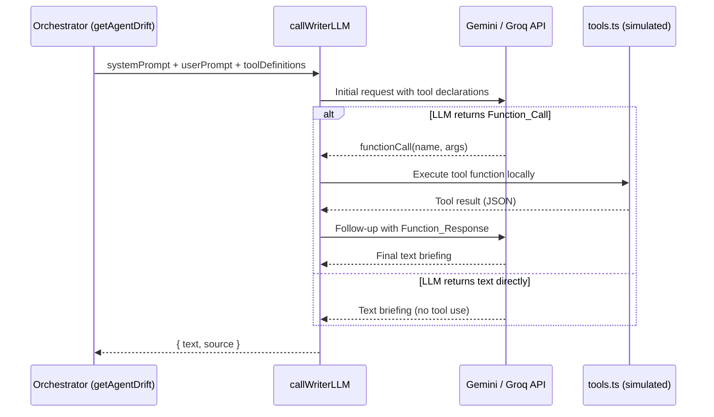
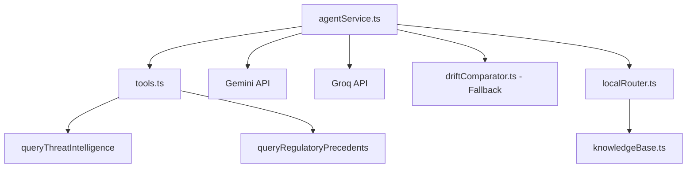
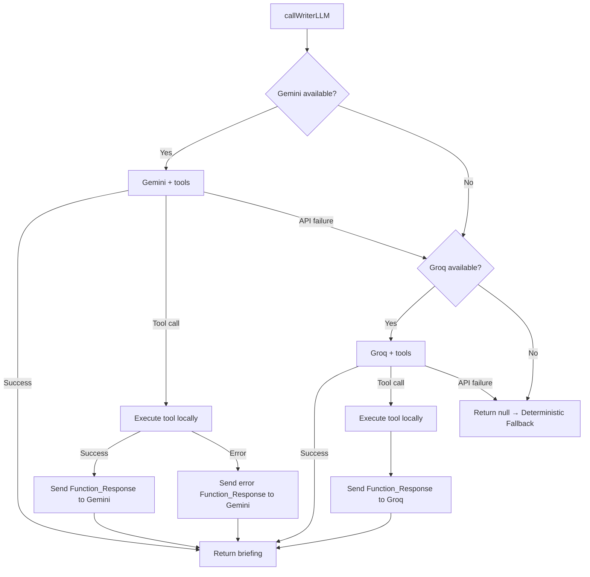

# Design Document: MCP Tool Calling (Phase 4)

## Overview

This design implements a ReAct-pattern agentic loop that enables DriftBrief's SOC and CISO writer agents to invoke simulated tools (threat intelligence and regulatory precedents) during briefing generation. The tools follow the MCP (Model Context Protocol) simulation pattern — they are local async functions that return structured data after a simulated delay, enriching LLM-generated briefings with contextual intelligence without external MCP server dependencies.

The implementation modifies the existing `callWriterLLM` function in `agentService.ts` to support a 2-iteration ReAct loop (initial LLM call → tool execution → follow-up LLM call), introduces a new `src/services/tools.ts` module with simulated tool functions, and adapts tool definition registration for both Gemini and Groq API formats.

### Design Rationale

- **Simulated tools over real MCP servers**: Keeps the demo self-contained, zero-cost, and fully functional offline while demonstrating the agentic pattern.
- **Max 2 iterations**: Prevents runaway loops and excessive API consumption. One tool call per agent invocation is sufficient for enrichment.
- **Provider-agnostic tool registration**: Tool definitions are registered in both Gemini (`functionDeclarations`) and Groq (`tools` array with OpenAI-compatible format) so the existing fallback chain works seamlessly.
- **Graceful degradation preserved**: The existing Gemini → Groq → Deterministic Fallback chain remains intact; tool failures are treated as soft errors that the LLM can recover from.

## Architecture



### Component Interaction



### Key Architecture Decisions

1. **Tool module is stateless**: `tools.ts` exports pure async functions with no shared state — each call is independent.
2. **Loop is scoped per-agent**: SOC and CISO agents run their loops independently and in parallel via `Promise.all`.
3. **Tool definitions injected at call site**: `callGemini` and `callGroq` accept optional tool definitions to keep provider functions reusable.
4. **Conversation history accumulated in-memory**: The ReAct loop builds a message array within the single `callWriterLLM` invocation — no persistent conversation state.

## Components and Interfaces

### New Module: `src/services/tools.ts`

```typescript
/** Result from the threat intelligence tool */
export interface ThreatIntelligenceResult {
  reputation: string;
  campaign: string;
  action_recommended: string;
}

/** Result from the regulatory precedents tool */
export interface RegulatoryPrecedentResult {
  max_penalty: string;
  recent_fine_example: string;
  notification_deadline: string;
}

/**
 * Simulates a threat intelligence lookup for a given IOC.
 * Returns classification based on IOC type (IP, hash, or unknown).
 * @param ioc - Indicator of Compromise value
 * @returns Structured threat intel result after 400-600ms simulated delay
 */
export async function queryThreatIntelligence(ioc: string): Promise<ThreatIntelligenceResult>;

/**
 * Simulates a regulatory precedent lookup for a given regulation.
 * Returns penalty data and enforcement examples for recognized regulations.
 * @param regulation - Regulation identifier (e.g., "GDPR", "NIS2")
 * @returns Structured regulatory precedent result after 400-600ms simulated delay
 */
export async function queryRegulatoryPrecedents(regulation: string): Promise<RegulatoryPrecedentResult>;
```

### Modified: `src/services/agentService.ts`

Key interface changes:

```typescript
/** Tool definition in Gemini format */
interface GeminiFunctionDeclaration {
  name: string;
  description: string;
  parameters: {
    type: string;
    properties: Record<string, { type: string; description: string }>;
    required: string[];
  };
}

/** Tool definition in Groq/OpenAI format */
interface GroqToolDefinition {
  type: 'function';
  function: {
    name: string;
    description: string;
    parameters: {
      type: 'object';
      properties: Record<string, { type: string; description: string }>;
      required: string[];
    };
  };
}

/** Registry mapping tool names to their implementations */
type ToolRegistry = Record<string, (args: Record<string, string>) => Promise<unknown>>;
```

### Modified function signatures:

```typescript
/** Extended to accept tool definitions and support ReAct loop */
async function callGemini(
  systemPrompt: string,
  userPrompt: string,
  toolDeclarations?: GeminiFunctionDeclaration[],
  toolRegistry?: ToolRegistry
): Promise<string | null>;

async function callGroq(
  systemPrompt: string,
  userPrompt: string,
  toolDefinitions?: GroqToolDefinition[],
  toolRegistry?: ToolRegistry
): Promise<string | null>;

/** Updated to accept tool config and orchestrate the ReAct loop */
async function callWriterLLM(
  systemPrompt: string,
  userPrompt: string,
  toolConfig?: {
    geminiDeclarations: GeminiFunctionDeclaration[];
    groqDefinitions: GroqToolDefinition[];
    registry: ToolRegistry;
  }
): Promise<{ text: string; source: DriftSource } | null>;
```

### Tool Definition Constants

```typescript
/** Gemini format tool declaration for queryThreatIntelligence */
const THREAT_INTEL_GEMINI_DECLARATION: GeminiFunctionDeclaration = {
  name: 'queryThreatIntelligence',
  description: 'Queries threat intelligence data for a given Indicator of Compromise (IOC). Returns reputation, campaign attribution, and recommended containment action.',
  parameters: {
    type: 'OBJECT',
    properties: {
      ioc: { type: 'STRING', description: 'The IOC value to look up (IP address, hash, or domain)' },
    },
    required: ['ioc'],
  },
};

/** Groq/OpenAI format tool definition for queryThreatIntelligence */
const THREAT_INTEL_GROQ_DEFINITION: GroqToolDefinition = {
  type: 'function',
  function: {
    name: 'queryThreatIntelligence',
    description: 'Queries threat intelligence data for a given Indicator of Compromise (IOC). Returns reputation, campaign attribution, and recommended containment action.',
    parameters: {
      type: 'object',
      properties: {
        ioc: { type: 'string', description: 'The IOC value to look up (IP address, hash, or domain)' },
      },
      required: ['ioc'],
    },
  },
};

/** Gemini format tool declaration for queryRegulatoryPrecedents */
const REGULATORY_GEMINI_DECLARATION: GeminiFunctionDeclaration = {
  name: 'queryRegulatoryPrecedents',
  description: 'Queries regulatory enforcement precedents and penalty examples for a given regulation. Returns max penalty, recent fine example, and notification deadline.',
  parameters: {
    type: 'OBJECT',
    properties: {
      regulation: { type: 'STRING', description: 'The regulation identifier (e.g., GDPR, NIS2)' },
    },
    required: ['regulation'],
  },
};

/** Groq/OpenAI format tool definition for queryRegulatoryPrecedents */
const REGULATORY_GROQ_DEFINITION: GroqToolDefinition = {
  type: 'function',
  function: {
    name: 'queryRegulatoryPrecedents',
    description: 'Queries regulatory enforcement precedents and penalty examples for a given regulation. Returns max penalty, recent fine example, and notification deadline.',
    parameters: {
      type: 'object',
      properties: {
        regulation: { type: 'string', description: 'The regulation identifier (e.g., GDPR, NIS2)' },
      },
      required: ['regulation'],
    },
  },
};
```

## Data Models

### Tool Result Types (in `src/services/tools.ts`)

```typescript
export interface ThreatIntelligenceResult {
  /** Threat score descriptor or malware family classification */
  reputation: string;
  /** Campaign name attribution */
  campaign: string;
  /** Recommended containment action */
  action_recommended: string;
}

export interface RegulatoryPrecedentResult {
  /** Maximum financial penalty description */
  max_penalty: string;
  /** Real enforcement case with entity name and fine amount */
  recent_fine_example: string;
  /** Mandatory breach notification timeframe */
  notification_deadline: string;
}
```

### IOC Classification Logic

| IOC Pattern | Detection | reputation | campaign | action_recommended |
|-------------|-----------|-----------|----------|-------------------|
| IPv4 (`/^\d{1,3}\.\d{1,3}\.\d{1,3}\.\d{1,3}$/`) | IP address | Threat score descriptor | Campaign name attribution | Firewall containment |
| Hex 32/40/64 chars (`/^[a-fA-F0-9]{32,64}$/`) | Hash (MD5/SHA1/SHA256) | Malware family classification | Campaign name attribution | Endpoint isolation |
| Empty/whitespace | Invalid | "unknown" | "none" | "no action" |
| Other | Unknown type | Generic low-confidence | "unattributed" | Monitoring action |

### Regulation Lookup Logic

| Regulation Input | Supported | Data Source |
|-----------------|-----------|-------------|
| "GDPR" (case-insensitive) | Yes | Static penalty data from EU enforcement |
| "NIS2" (case-insensitive) | Yes | Static penalty data from directive |
| Unrecognized string | No | Generic "unavailable" response |
| Empty string | No | "No regulation specified" response |

### Gemini Function Call/Response Format

```typescript
// Function Call (from Gemini response)
{
  candidates: [{
    content: {
      parts: [{
        functionCall: {
          name: 'queryThreatIntelligence',
          args: { ioc: '185.220.101.42' }
        }
      }]
    }
  }]
}

// Function Response (sent back to Gemini)
{
  contents: [
    { role: 'user', parts: [{ text: userPrompt }] },
    { role: 'model', parts: [{ functionCall: { name: '...', args: {...} } }] },
    { role: 'function', parts: [{ functionResponse: { name: '...', response: { result: {...} } } }] }
  ]
}
```

### Groq Function Call/Response Format

```typescript
// Function Call (from Groq response)
{
  choices: [{
    message: {
      role: 'assistant',
      content: null,
      tool_calls: [{
        id: 'call_abc123',
        type: 'function',
        function: { name: 'queryThreatIntelligence', arguments: '{"ioc":"185.220.101.42"}' }
      }]
    }
  }]
}

// Function Response (sent back to Groq)
{
  messages: [
    { role: 'system', content: systemPrompt },
    { role: 'user', content: userPrompt },
    { role: 'assistant', content: null, tool_calls: [...] },
    { role: 'tool', tool_call_id: 'call_abc123', content: '{"reputation":"...","campaign":"...","action_recommended":"..."}' }
  ]
}
```


## Correctness Properties

*A property is a characteristic or behavior that should hold true across all valid executions of a system — essentially, a formal statement about what the system should do. Properties serve as the bridge between human-readable specifications and machine-verifiable correctness guarantees.*

### Property 1: IOC classification correctness

*For any* string input to `queryThreatIntelligence`, the returned `ThreatIntelligenceResult` SHALL have all three required fields (`reputation`, `campaign`, `action_recommended`) as non-empty strings, AND the field values SHALL match the IOC type classification: IPv4 addresses produce firewall-related actions, hex strings of 32/40/64 characters produce endpoint isolation actions, whitespace-only strings produce `reputation="unknown"`, `campaign="none"`, `action_recommended="no action"`, and all other non-empty strings produce `campaign="unattributed"` with a monitoring action.

**Validates: Requirements 1.2, 1.3, 1.4, 1.5, 1.6**

### Property 2: Unrecognized regulation returns unavailable response

*For any* string input to `queryRegulatoryPrecedents` that is not in the recognized set ("GDPR", "NIS2") and is non-empty, the returned `RegulatoryPrecedentResult` SHALL have `max_penalty` indicating specific penalty data is unavailable, `recent_fine_example` indicating no precedent data exists, and `notification_deadline` indicating the deadline is unspecified.

**Validates: Requirements 2.3**

### Property 3: SOC tool registration in correct API format

*For any* valid Drift object, when constructing the SOC writer agent request, the payload SHALL contain the `queryThreatIntelligence` tool definition in the correct format for the target API — `functionDeclarations` array with correct parameter schema for Gemini, and `tools` array with `type: "function"` wrapper for Groq.

**Validates: Requirements 3.1, 3.2**

### Property 4: SOC prompt instruction presence is conditional on IOCs

*For any* valid Drift object, the SOC system prompt SHALL contain an instruction directing the LLM to invoke `queryThreatIntelligence` if and only if `drift.newIOCs.length > 0`. When `newIOCs` is empty, the tool definition is still registered but no prompt instruction is included.

**Validates: Requirements 3.4, 3.5**

### Property 5: CISO tool registration and prompt instruction

*For any* valid Drift object, when constructing the CISO writer agent request, the payload SHALL contain the `queryRegulatoryPrecedents` tool definition in the correct format for the target API, AND the CISO system prompt SHALL include an instruction directing the LLM to invoke `queryRegulatoryPrecedents` with the applicable regulation identifier.

**Validates: Requirements 4.1, 4.3**

### Property 6: SOC request excludes regulatory tool

*For any* valid Drift object, when constructing the SOC writer agent request, the payload SHALL NOT contain the `queryRegulatoryPrecedents` tool definition in either the `functionDeclarations` array (Gemini) or the `tools` array (Groq).

**Validates: Requirements 4.4**

### Property 7: Unregistered function produces error Function_Response

*For any* function name not present in the tool registry, when the LLM returns a `Function_Call` referencing that name, the agentic loop SHALL construct a `Function_Response` containing an error message indicating the function is not available, and send it back to the LLM.

**Validates: Requirements 5.3**

### Property 8: Tool error sanitization

*For any* exception thrown by a tool function, the constructed error `Function_Response` SHALL have `error` set to `true` and a `message` field that excludes API keys (strings matching `VITE_*` environment variable patterns), authentication tokens (Bearer tokens, Authorization headers), and internal file paths (absolute paths containing `/src/` or `/home/`).

**Validates: Requirements 7.1**

### Property 9: Malformed function call graceful handling

*For any* LLM response containing a malformed `Function_Call` (missing function name, unparseable arguments JSON, or null function call fields), the agentic loop SHALL either extract text content present alongside the malformed call OR return null to trigger the deterministic fallback — never throw an unhandled exception.

**Validates: Requirements 8.2**

### Property 10: Deterministic fallback completeness

*For any* pair of valid Snapshot objects with valid `id` fields forming a known `TransitionId`, `calculateDrift` SHALL return a `Drift` object with non-empty `socBriefing` (string length > 0) and non-empty `cisoBriefing` (string length > 0).

**Validates: Requirements 8.4**

### Property 11: Final briefing contains no JSON syntax artifacts

*For any* validated briefing text that passes through `validateWriterResponse` and is rendered to the user, the string SHALL contain zero JSON structural characters used as data formatting (specifically: no `{`, `}`, `[`, `]` characters, and no `"key":` patterns that indicate raw JSON was echoed into the prose).

**Validates: Requirements 9.4**

## Error Handling

### Error Hierarchy and Recovery

| Error Source | Error Type | Recovery Strategy | Logs |
|---|---|---|---|
| Tool function throws | Runtime exception | Catch → sanitize → send error Function_Response to LLM → LLM generates briefing without tool data | `console.error('[AgentService] queryThreatIntelligence: <sanitized message>')` |
| LLM returns unregistered function | Logic error | Construct "function not available" Function_Response → send back to LLM | `console.warn('[AgentService] Unregistered function requested: <name>')` |
| LLM returns malformed Function_Call | Parse error | Treat as text response (extract text) or return null for fallback | `console.warn('[AgentService] Malformed function call, treating as text')` |
| Gemini API timeout/error | Network error | Fall through to Groq in existing fallback chain | `console.warn('[Multi-Agent] Gemini falló: <message>')` |
| Groq API timeout/error | Network error | Fall through to deterministic fallback | `console.warn('[Multi-Agent] Groq falló: <message>')` |
| Max iterations reached | Safety limit | Return any available text or deterministic fallback | `console.warn('[AgentService] callWriterLLM: max iterations (2) reached')` |
| Follow-up LLM call fails | Network/parse error | Return null → triggers deterministic fallback for that agent | `console.warn('[Multi-Agent] <provider> falló: <message>')` |

### Sanitization Rules for Error Messages

Before logging or including error details in Function_Response messages:

1. **Remove API keys**: Strip any string matching `VITE_*` env variable values or patterns like `key=`, `Bearer `, `Authorization:`
2. **Remove file paths**: Strip absolute paths containing `/home/`, `/src/`, or OS-specific path separators
3. **Remove stack traces**: Only include `error.message`, never `error.stack`
4. **Truncate long messages**: Cap error message at 200 characters to prevent log flooding

### Graceful Degradation Flow



## Testing Strategy

### Property-Based Testing (PBT)

**Library**: [fast-check](https://github.com/dubzzz/fast-check) — the standard PBT library for TypeScript/JavaScript.

**Configuration**:
- Minimum 100 iterations per property test
- Each property test references its design document property number
- Tag format: `Feature: mcp-tool-calling, Property {N}: {title}`

**Property tests cover**:
- `queryThreatIntelligence` IOC classification logic (Property 1)
- `queryRegulatoryPrecedents` unrecognized regulation handling (Property 2)
- Tool definition registration correctness per API format (Properties 3, 5, 6)
- Prompt instruction conditional logic (Property 4)
- Error sanitization (Property 8)
- Malformed function call handling (Property 9)
- Deterministic fallback completeness (Property 10)
- JSON-free briefing output (Property 11)

### Unit Tests (Example-Based)

- Recognized regulation lookup returns correct data for "GDPR" and "NIS2" (Req 2.2)
- Empty string regulation returns "no regulation specified" (Req 2.4)
- Tool definition constants have correct structure (Reqs 3.3, 4.2)
- ReAct loop terminates at max 2 iterations (Req 6.1)
- Loop returns text directly when no Function_Call present (Req 5.2)
- Loop terminates when follow-up still has Function_Call (Req 5.4)
- Max iteration warning is logged (Req 6.3)
- Tool error continues loop and returns LLM text (Req 7.2)
- Tool error logs with correct prefix and sanitized content (Req 7.3)
- Double failure (tool + LLM) produces deterministic fallback (Req 7.4)
- Graceful degradation logs fallback reason (Req 8.3)
- fallbackReason field present on degradation (Req 8.5)

### Integration Tests

- Full ReAct loop with mocked Gemini API returning function call → tool execution → follow-up → text (Req 5.1)
- Full ReAct loop with mocked Groq API using tool_calls format (Req 5.5)
- API fallback chain: Gemini fail → Groq attempt → deterministic fallback (Req 8.1)
- SOC briefing contains threat intel data as prose (Req 9.1)
- CISO briefing contains regulatory data as prose (Req 9.2)
- Function_Response format correctness per provider (Req 9.3)
- Malformed tool response falls back gracefully (Req 9.5)

### Test File Structure

```
src/services/__tests__/
├── tools.test.ts                 # Unit + PBT for tools.ts
├── tools.property.test.ts        # PBT-only: Properties 1, 2
├── agentService.tool-registration.test.ts  # PBT: Properties 3-6
├── agentService.react-loop.test.ts         # Unit + Integration: ReAct loop
├── agentService.error-handling.test.ts     # PBT: Properties 7-9, Unit: error scenarios
└── agentService.fallback.test.ts           # PBT: Property 10, Unit: degradation
```
