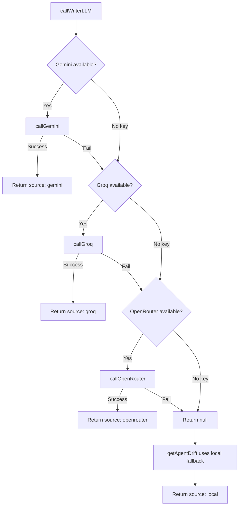
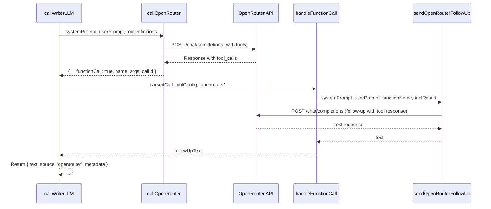

# Design Document: OpenRouter Fallback Provider

## Overview

This design extends the existing Agent Service fallback chain from Gemini → Groq → Local to Gemini → Groq → **OpenRouter** → Local. OpenRouter uses the `meta-llama/llama-3.1-8b-instruct:free` model with an OpenAI-compatible API format, providing an additional free redundancy layer before the deterministic local engine.

The implementation follows the same architectural patterns established by the existing `callGroq` function, since both providers use OpenAI-compatible request/response formats. A new `callOpenRouter` function will be added alongside existing provider functions, and the `callWriterLLM` orchestrator will be extended to attempt OpenRouter after Groq fails.

### Key Design Decisions

1. **Reuse Groq patterns**: Since OpenRouter uses the same OpenAI-compatible format as Groq, the `callOpenRouter` function mirrors `callGroq` in structure (request body, response parsing, tool_calls detection).
2. **No structured output mode**: Unlike Groq (which uses `response_format` for JSON schema enforcement), OpenRouter's free-tier model may not support strict JSON mode. The function relies on prompt-based JSON formatting, consistent with how tool-calling mode already works.
3. **Zero cost constant**: The free-tier model costs $0/token, so `OPENROUTER_COST_PER_TOKEN = 0` is declared as a constant for consistency with the existing pricing pattern.
4. **ToolConfig extension**: The `ToolConfig` interface gains an `openrouterDefinitions` field (same shape as `groqDefinitions`) so tool-calling works identically to Groq.

## Architecture



### Sequence Diagram: OpenRouter Call with Tool-Calling



## Components and Interfaces

### New Function: `callOpenRouter`

```typescript
/**
 * Executes a call to OpenRouter with OpenAI-compatible format.
 * Supports both plain text responses and tool-calling mode.
 * @param systemPrompt - System instruction
 * @param userPrompt - User message
 * @param toolDefinitions - Optional tool definitions (same format as Groq)
 * @param _toolRegistry - Tool registry (reserved for ReAct loop)
 * @returns LLMCallResult with text and metadata, or null on failure
 */
async function callOpenRouter(
  systemPrompt: string,
  userPrompt: string,
  toolDefinitions?: GroqToolDefinition[],
  _toolRegistry?: ToolRegistry
): Promise<LLMCallResult | null>
```

### New Function: `sendOpenRouterFollowUp`

```typescript
/**
 * Sends an OpenRouter follow-up request containing the tool response after execution.
 * Mirrors sendGroqFollowUp but targets the OpenRouter endpoint with appropriate headers.
 * @param systemPrompt - Original system instruction
 * @param userPrompt - Original user message
 * @param functionName - Name of the function that was called
 * @param functionArgs - Arguments the LLM passed to the function
 * @param toolResult - Result from executing the tool
 * @param callId - The tool_call_id from the original response
 * @param toolDefinitions - Tool definitions to include in follow-up
 * @returns Text response from the follow-up or null on failure
 */
async function sendOpenRouterFollowUp(
  systemPrompt: string,
  userPrompt: string,
  functionName: string,
  functionArgs: Record<string, string>,
  toolResult: unknown,
  callId: string,
  toolDefinitions: GroqToolDefinition[]
): Promise<string | null>
```

### Modified Type: `DriftSource`

```typescript
export type DriftSource = 'gemini' | 'groq' | 'openrouter' | 'local';
```

### Modified Interface: `ToolConfig`

```typescript
interface ToolConfig {
  geminiDeclarations: GeminiFunctionDeclaration[];
  groqDefinitions: GroqToolDefinition[];
  openrouterDefinitions: GroqToolDefinition[]; // Same format as Groq (OpenAI-compatible)
  registry: ToolRegistry;
}
```

### New Constant: `OPENROUTER_COST_PER_TOKEN`

```typescript
const OPENROUTER_COST_PER_TOKEN = 0;
```

### Modified Function: `computeEstimatedCost`

The function gains a case for `'openrouter'` that returns `0.0000` (since the model is free-tier):

```typescript
function computeEstimatedCost(tokensConsumed: number | null, source: DriftSource): number | null {
  if (tokensConsumed === null) return null;
  const costMap: Record<DriftSource, number> = {
    gemini: GEMINI_COST_PER_TOKEN,
    groq: GROQ_COST_PER_TOKEN,
    openrouter: OPENROUTER_COST_PER_TOKEN,
    local: 0,
  };
  const costPerToken = costMap[source] ?? 0;
  return parseFloat((tokensConsumed * costPerToken).toFixed(4));
}
```

### Modified Function: `callWriterLLM`

Extended to try OpenRouter after Groq fails, following the same pattern for both simple and tool-calling modes:

```typescript
// After Groq fails (both with and without toolConfig):
const openRouterResult = await callOpenRouter(systemPrompt, userPrompt, toolConfig?.openrouterDefinitions, toolConfig?.registry);
if (openRouterResult) {
  // Handle tool-calling or plain text (same pattern as Groq)
  return { text: openRouterResult.text, source: 'openrouter', metadata: openRouterResult.metadata };
}
return null;
```

### Modified Function: `getAgentDrift` (Source Priority)

The source priority logic is updated to include 'openrouter':

```typescript
// Priority: gemini > groq > openrouter > local
if (socResult?.source === 'gemini' || cisoResult?.source === 'gemini') {
  source = 'gemini';
} else if (socResult?.source === 'groq' || cisoResult?.source === 'groq') {
  source = 'groq';
} else {
  source = 'openrouter';
}
```

### Modified: `handleFunctionCall`

The provider parameter type is extended and OpenRouter follow-up is handled:

```typescript
async function handleFunctionCall(
  parsedCall: { name: string; args: Record<string, string>; callId?: string },
  systemPrompt: string,
  userPrompt: string,
  toolConfig: ToolConfig,
  provider: 'gemini' | 'groq' | 'openrouter'
): Promise<string | null>
```

### Environment Configuration

```env
# OpenRouter API (optional - third fallback before deterministic local engine)
VITE_OPENROUTER_API_KEY=
```

## Data Models

No new data types are introduced. The changes affect existing types:

| Type | Change | Details |
|------|--------|---------|
| `DriftSource` | Extended | Added `'openrouter'` literal |
| `ToolConfig` | Extended | Added `openrouterDefinitions: GroqToolDefinition[]` |
| `LLMCallMetadata` | Unchanged | Reused as-is for OpenRouter telemetry |
| `LLMCallResult` | Unchanged | Reused as-is for OpenRouter responses |
| `TelemetryData` | Unchanged | Already supports the new source |

### OpenRouter Request Body Shape

```typescript
{
  model: 'meta-llama/llama-3.1-8b-instruct:free',
  messages: [
    { role: 'system', content: systemPrompt },
    { role: 'user', content: userPrompt }
  ],
  temperature: 0.0,
  // When tool-calling:
  tools?: GroqToolDefinition[]
}
```

### OpenRouter Response Shape (Success)

```typescript
{
  choices: [{
    message: {
      content: string | null,
      tool_calls?: [{
        id: string,
        type: 'function',
        function: { name: string, arguments: string }
      }]
    }
  }],
  usage?: {
    total_tokens: number
  }
}
```

## Correctness Properties

*A property is a characteristic or behavior that should hold true across all valid executions of a system — essentially, a formal statement about what the system should do. Properties serve as the bridge between human-readable specifications and machine-verifiable correctness guarantees.*

### Property 1: Missing API key skips provider without side effects

*For any* value of `VITE_OPENROUTER_API_KEY` that is undefined, null, empty string, or composed entirely of whitespace, calling `callOpenRouter` SHALL return null without invoking `fetch` or throwing an exception.

**Validates: Requirements 1.3, 5.3**

### Property 2: Valid response content extraction

*For any* HTTP 2xx response from OpenRouter containing a non-empty string at `choices[0].message.content`, the function SHALL extract and return exactly that string as the text field of the result.

**Validates: Requirements 1.5**

### Property 3: Malformed response structure yields failure

*For any* HTTP 2xx response where the `choices` array is empty, absent, or where `choices[0].message.content` is null, undefined, or empty string, the function SHALL return null.

**Validates: Requirements 1.6, 6.2**

### Property 4: Error resilience returns null for all failure modes

*For any* error condition — HTTP status outside 200-299, request timeout exceeding 10 seconds, DNS resolution failure, connection refused, or connection reset — the function SHALL return null without throwing an unhandled exception.

**Validates: Requirements 1.4, 6.4, 6.5**

### Property 5: Non-JSON response body yields null with sanitized warning

*For any* response body that cannot be parsed as valid JSON (HTML error pages, truncated payloads, malformed syntax), the function SHALL log a warning processed through `sanitizeErrorMessage` and return null.

**Validates: Requirements 6.1**

### Property 6: Token usage extraction with graceful null handling

*For any* OpenRouter response, if `usage.total_tokens` is a number, the returned metadata SHALL contain that value as `tokensConsumed` alongside the measured `latencyMs`. If `usage.total_tokens` is absent or non-numeric, `tokensConsumed` SHALL be null while `latencyMs` remains a valid non-negative integer.

**Validates: Requirements 1.7, 4.6**

### Property 7: Source priority ordering

*For any* combination of DriftSource values from parallel SOC and CISO agent calls, the selected source in `AgentDriftResult` SHALL follow the priority order: 'gemini' > 'groq' > 'openrouter' > 'local', selecting the highest-priority source present among successful responses.

**Validates: Requirements 3.3**

### Property 8: Error messages are sanitized before logging

*For any* error message originating from OpenRouter interactions that contains VITE_* environment variable values, Bearer tokens, Authorization headers, or absolute file paths, the logged message SHALL have those patterns redacted by `sanitizeErrorMessage` and be truncated to at most 200 characters.

**Validates: Requirements 6.3**

### Property 9: ReAct loop terminates within 2 iterations

*For any* sequence of OpenRouter responses containing tool_calls, the system SHALL execute at most one tool call and one follow-up request (2 total iterations). If the follow-up also returns a tool_call, the system SHALL terminate the loop and return null for that provider.

**Validates: Requirements 2.5**

## Error Handling

### Error Categories and Responses

| Error Type | Detection | Response | Logging |
|-----------|-----------|----------|---------|
| Missing API key | `!apiKey` or whitespace-only | Return `null` immediately | None (silent skip) |
| HTTP non-2xx | `!response.ok` | Return `null` | `console.warn` with sanitized message |
| Timeout (10s) | `AbortSignal.timeout(10000)` | Return `null` | `console.warn` with sanitized message |
| Network error | `catch` block (TypeError) | Return `null` | `console.warn` with sanitized message |
| Invalid JSON body | `JSON.parse` throws | Return `null` | `console.warn` with sanitized message |
| Empty/missing content | Defensive check | Return `null` | `console.warn` with sanitized message |
| Malformed tool_call | Missing function name | Return `null` | `console.warn` with context |

### Security Constraints

- API key is NEVER logged, even partially
- All error messages pass through `sanitizeErrorMessage()` before `console.warn`
- File paths and Bearer tokens in error messages are redacted
- No sensitive data in `fallbackReason` strings (only provider names and generic failure descriptions)

### Graceful Degradation Flow

```
callOpenRouter fails → returns null
  → callWriterLLM returns null for that provider
    → getAgentDrift uses baseDrift (deterministic fallback)
      → Returns AgentDriftResult with source: 'local'
```

## Testing Strategy

### Property-Based Tests (vitest + fast-check)

Property-based testing is appropriate for this feature because:
- `callOpenRouter` is a function with clear input/output behavior
- Universal properties hold across a wide range of inputs (any prompt, any response shape)
- The input space is large (arbitrary strings, arbitrary JSON response bodies)
- We are testing parsing logic, error handling, and data transformation

**Configuration:**
- Minimum 100 iterations per property test
- Each property test references its design document property
- Tag format: **Feature: openrouter-fallback-provider, Property {N}: {title}**

**Library:** `fast-check` (already used in the project for existing property tests)

**Property tests to implement:**
1. Missing/empty API key → null without fetch (Property 1)
2. Valid response extraction (Property 2)
3. Malformed response → null (Property 3)
4. Error resilience for all failure modes (Property 4)
5. Non-JSON response handling (Property 5)
6. Token usage extraction with null handling (Property 6)
7. Source priority ordering (Property 7)
8. Error message sanitization (Property 8)
9. ReAct loop bounded iteration (Property 9)

### Unit Tests (vitest)

Example-based tests for specific scenarios:
- HTTP headers include Authorization, Content-Type, HTTP-Referer, X-Title (Req 1.2)
- AbortSignal.timeout(10000) is passed to fetch (Req 6.4)
- `computeEstimatedCost` returns 0.0000 for 'openrouter' source (Req 4.3)
- fallbackReason message content when Gemini+Groq fail (Req 4.4)
- All remote providers fail → source 'local' with appropriate fallbackReason (Req 3.4)

### Integration Tests (vitest with mocked fetch)

- Full fallback chain order: Gemini → Groq → OpenRouter → Local (Req 1.8, 2.1-2.4)
- OpenRouter skipped when key missing, chain continues to local (Req 2.6, 5.4)
- `getAgentDrift` returns correct source and telemetry when OpenRouter serves (Req 3.2)
- Telemetry panel displays 'openrouter' label (Req 4.5)

### Smoke Tests

- `.env.example` contains `VITE_OPENROUTER_API_KEY=` with comment (Req 5.1)
- TypeScript compilation accepts `'openrouter'` as DriftSource (Req 3.1)
- No references to `process.env` or hardcoded keys for OpenRouter (Req 5.2)
