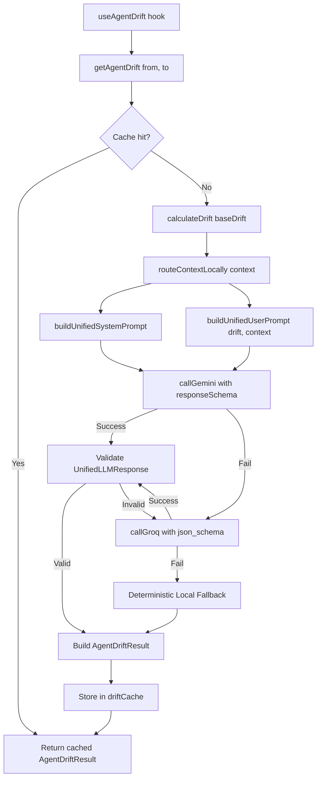

# Design Document: Single-Pass Orchestration

## Overview

This design refactors the `getAgentDrift()` orchestrator in `src/services/agentService.ts` from a dual parallel LLM call pattern (SOC + CISO via `Promise.all`) to a single-pass architecture that:

1. **Checks an in-memory cache** before any computation
2. **Builds a unified prompt** requesting both briefings in one structured response
3. **Makes a single sequential LLM call** with fallback: Gemini → Groq → Deterministic Local
4. **Validates and caches** the result before returning

This eliminates HTTP 429 rate-limit errors caused by concurrent requests, halves token consumption, and simplifies the fallback chain by removing OpenRouter and retry logic.

### Key Design Decisions

| Decision | Rationale |
|----------|-----------|
| Single prompt vs. dual prompts | Eliminates concurrent 429s, reduces total tokens by ~40% |
| In-memory Map cache (no TTL) | Static demo data never changes; simplest correct solution |
| Sequential fallback (no retry) | 429 errors are quota-based — retrying the same provider is futile |
| Remove OpenRouter from chain | Simplifies to two providers + deterministic local; reduces surface area |
| Gemini `responseSchema` + Groq `json_schema` | Both enforce structured output natively without post-hoc parsing |

## Architecture



## Components and Interfaces

### New Interface: `UnifiedLLMResponse`

```typescript
/** Structured response from the unified single-pass LLM call */
interface UnifiedLLMResponse {
  /** SOC technical briefing text */
  socBriefing: string;
  /** CISO executive briefing text */
  cisoBriefing: string;
  /** Urgent decision summary */
  urgentDecision: string;
}
```

### New Constants

#### `UNIFIED_RESPONSE_SCHEMA` (Gemini format)

```typescript
const UNIFIED_RESPONSE_SCHEMA = {
  type: 'OBJECT',
  properties: {
    socBriefing: { type: 'STRING', description: 'SOC technical incident briefing' },
    cisoBriefing: { type: 'STRING', description: 'CISO executive risk briefing' },
    urgentDecision: { type: 'STRING', description: 'Urgent decision summary' },
  },
  required: ['socBriefing', 'cisoBriefing', 'urgentDecision'],
  propertyOrdering: ['socBriefing', 'cisoBriefing', 'urgentDecision'],
} as const;
```

#### `GROQ_UNIFIED_SCHEMA` (Groq format)

```typescript
const GROQ_UNIFIED_SCHEMA = {
  type: 'json_schema' as const,
  json_schema: {
    name: 'unified_drift_response',
    strict: true,
    schema: {
      type: 'object',
      properties: {
        socBriefing: { type: 'string', description: 'SOC technical incident briefing' },
        cisoBriefing: { type: 'string', description: 'CISO executive risk briefing' },
        urgentDecision: { type: 'string', description: 'Urgent decision summary' },
      },
      required: ['socBriefing', 'cisoBriefing', 'urgentDecision'],
      additionalProperties: false,
    },
  },
};
```

### New Functions

#### `buildUnifiedSystemPrompt(): string`

Combines SOC directives, CISO directives, and anti-hallucination guardrails into a single system prompt. Requests the LLM to return a JSON object with all three fields.

#### `buildUnifiedUserPrompt(drift: Drift, context: RouterContext): string`

Merges drift data, MITRE tactic, regulation, and playbooks into one user message — the same information currently split across `buildSOCPrompt` and `buildCISOPrompt`.

#### `validateUnifiedResponse(parsed: unknown): UnifiedLLMResponse | null`

Validates that a parsed JSON object contains non-empty `socBriefing`, `cisoBriefing`, and `urgentDecision` string fields. Returns the typed object or `null` on failure.

### Modified Module-Level State

```typescript
/** In-memory cache indexed by Transition_Key (fromId-toId) */
const driftCache = new Map<string, AgentDriftResult>();
```

### Modified Function: `getAgentDrift(from, to)`

New flow (replaces current `Promise.all` pattern):

```typescript
export async function getAgentDrift(from: Snapshot, to: Snapshot): Promise<AgentDriftResult> {
  const cacheKey = `${from.id}-${to.id}`;

  // 1. Cache check
  const cached = driftCache.get(cacheKey);
  if (cached) return cached;

  // 2. Deterministic drift
  const baseDrift = calculateDrift(from, to);

  // 3. Local routing
  const context = getIncidentContext(baseDrift);

  // 4. Build unified prompts
  const systemPrompt = buildUnifiedSystemPrompt();
  const userPrompt = buildUnifiedUserPrompt(baseDrift, context);

  // 5. Sequential fallback: Gemini → Groq → Local
  let result = await tryGemini(systemPrompt, userPrompt);
  if (!result) result = await tryGroq(systemPrompt, userPrompt);

  // 6. Build final AgentDriftResult
  const agentResult = buildResult(baseDrift, result);

  // 7. Cache and return
  driftCache.set(cacheKey, agentResult);
  return agentResult;
}
```

### Preserved Exports (Backward Compatibility)

These exported symbols remain unchanged in signature and behavior:
- `getAgentDrift(from, to): Promise<AgentDriftResult>`
- `callOpenRouter(...)` — still exported (used by tests) but removed from the internal fallback chain
- `sendOpenRouterFollowUp(...)` — still exported
- `sanitizeErrorMessage(...)` — still exported
- `buildSOCSystemPrompt(drift)` — still exported
- `buildCISOSystemPrompt()` — still exported
- Type exports: `DriftSource`, `AgentDriftResult`, `GeminiFunctionDeclaration`, `GroqToolDefinition`, `ToolRegistry`

## Data Models

### Cache Entry

| Field | Type | Description |
|-------|------|-------------|
| key | `string` | `${from.id}-${to.id}` |
| value | `AgentDriftResult` | Complete result with drift, source, fallbackReason, telemetry |

### `AgentDriftResult` (unchanged)

```typescript
interface AgentDriftResult {
  drift: Drift;
  source: DriftSource;       // 'gemini' | 'groq' | 'local'
  fallbackReason?: string;
  telemetry?: TelemetryData;
}
```

### `DriftSource` (narrowed)

The `'openrouter'` value is still part of the union type (for backward compatibility with existing test expectations) but will never be produced by the refactored `getAgentDrift`.

## Correctness Properties

*A property is a characteristic or behavior that should hold true across all valid executions of a system — essentially, a formal statement about what the system should do. Properties serve as the bridge between human-readable specifications and machine-verifiable correctness guarantees.*

### Property 1: Cache round-trip

*For any* pair of snapshots `(from, to)`, if `getAgentDrift(from, to)` is called and produces a result `R`, then calling `getAgentDrift(from, to)` again SHALL return the same `R` without making any API call.

**Validates: Requirements 2.2, 2.3**

### Property 2: Unified prompt completeness

*For any* valid Drift object and RouterContext, `buildUnifiedUserPrompt(drift, context)` SHALL produce a string that contains the drift headline, MITRE tactic ID, regulation name, and instructs the LLM to respond with `socBriefing`, `cisoBriefing`, and `urgentDecision`.

**Validates: Requirements 1.2**

### Property 3: Response validation correctness

*For any* JSON object, `validateUnifiedResponse(obj)` SHALL return a non-null `UnifiedLLMResponse` if and only if `obj.socBriefing`, `obj.cisoBriefing`, and `obj.urgentDecision` are all non-empty strings.

**Validates: Requirements 1.4**

### Property 4: Sequential fallback with no parallelism

*For any* pair of snapshots where the cache is empty, the orchestrator SHALL attempt Gemini first, then Groq only if Gemini fails, and never call both concurrently. If both fail, the result SHALL have `source === 'local'`.

**Validates: Requirements 1.1, 1.5, 3.1, 3.3, 3.4**

### Property 5: No retry on provider error

*For any* provider that returns an error (HTTP 429 or otherwise), the orchestrator SHALL make exactly one request to that provider — never retrying it within the same `getAgentDrift` invocation.

**Validates: Requirements 3.2**

### Property 6: AgentDriftResult structural invariant

*For any* pair of snapshots, the returned `AgentDriftResult` SHALL always contain a valid `drift` object (with non-empty `socBriefing` and `cisoBriefing` strings) and a `source` field that is one of `'gemini' | 'groq' | 'local'`.

**Validates: Requirements 4.1, 2.4**

### Property 7: Serialization round-trip

*For any* valid `UnifiedLLMResponse` object, `JSON.parse(JSON.stringify(response))` SHALL produce a deeply equal object.

**Validates: Requirements 5.6**

## Error Handling

| Scenario | Behavior |
|----------|----------|
| Gemini returns HTTP 429 / timeout / network error | Log warning, fall through to Groq immediately |
| Groq returns HTTP 429 / timeout / network error | Log warning, fall through to deterministic local |
| LLM returns invalid JSON | Treat as provider failure, fall through |
| LLM returns valid JSON but validation fails (empty fields) | Treat as provider failure, fall through |
| No API keys configured (`VITE_GEMINI_API_KEY` / `VITE_GROQ_API_KEY` absent) | Skip provider silently, fall through |
| `calculateDrift` or `routeContextLocally` throws | Not expected (pure functions on static data), but would propagate — acceptable crash since it indicates a code bug |

All error messages are sanitized via `sanitizeErrorMessage()` before logging to prevent API key leakage.

## Testing Strategy

### Unit Tests (example-based)

- Verify `buildUnifiedSystemPrompt()` contains SOC directives, CISO directives, and anti-hallucination guardrails
- Verify `UNIFIED_RESPONSE_SCHEMA` and `GROQ_UNIFIED_SCHEMA` define all three required fields
- Verify Gemini request includes `responseSchema` in `generationConfig`
- Verify Groq request includes `response_format` with `json_schema`
- Verify OpenRouter is never called by the refactored `getAgentDrift`
- Verify `useAgentDrift` hook still calls `getAgentDrift(from, to)` with unchanged signature

### Property-Based Tests (fast-check, minimum 100 iterations)

Each property from the Correctness Properties section will be implemented as a property-based test using `fast-check`:

| Property | Generator Strategy |
|----------|-------------------|
| P1: Cache round-trip | Generate random snapshot pairs, call twice, assert same result + zero fetches on second call |
| P2: Unified prompt completeness | Generate random Drift objects + RouterContext, assert output contains required fragments |
| P3: Response validation | Generate random objects (valid/invalid), assert correct accept/reject |
| P4: Sequential fallback | Mock providers to fail selectively, assert correct provider order and no concurrency |
| P5: No retry | Mock provider errors, count calls per provider |
| P6: Structural invariant | Generate random snapshot pairs with various provider behaviors, assert return shape |
| P7: Serialization round-trip | Generate random UnifiedLLMResponse, assert JSON round-trip equality |

**Tag format:** `Feature: single-pass-orchestration, Property {N}: {title}`

### Integration Tests

- End-to-end: `getAgentDrift` with real static demo snapshots (A→B, B→C) returns valid results
- `npm run build` passes with zero TypeScript errors
- `npm run test` passes all existing + new tests
