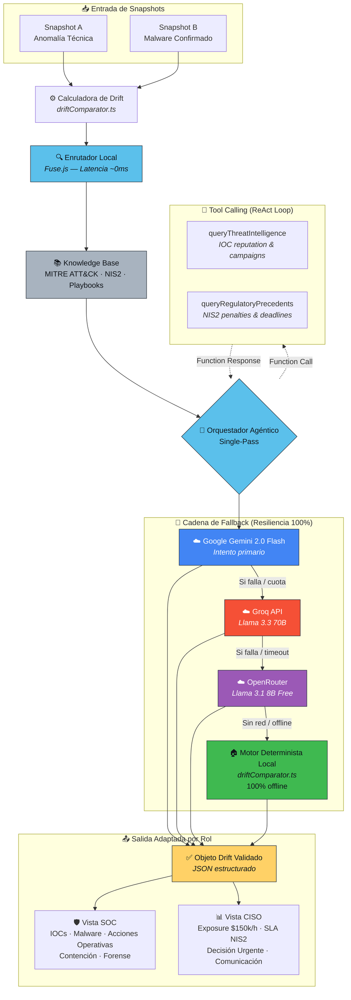
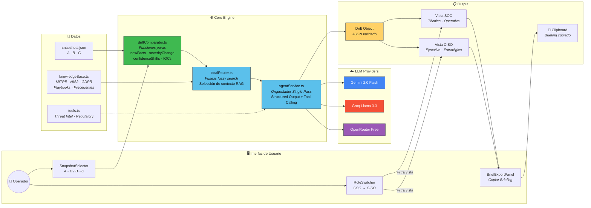

# DriftBrief — Arquitectura Técnica

> Diagramas de arquitectura para presentación en video del proyecto.

---

## Diagrama 1: Pipeline de Resiliencia Agéntica (Single-Pass & Fallback)

---

## Diagrama 2: Flujo de Datos End-to-End (Usuario → Briefing)

---

## Resumen de Componentes Clave

| Componente | Archivo | Responsabilidad |
|---|---|---|
| **Calculadora de Drift** | `driftComparator.ts` | Funciones puras: compara snapshots, produce Drift JSON |
| **Enrutador Local** | `localRouter.ts` | Búsqueda difusa Fuse.js para seleccionar contexto RAG |
| **Knowledge Base** | `knowledgeBase.ts` | MITRE ATT&CK, NIS2, GDPR, Playbooks de incidentes |
| **Tool Calling** | `tools.ts` | Threat Intelligence y Regulatory Precedents |
| **Orquestador Agéntico** | `agentService.ts` | Single-pass con cadena de fallback y structured output |
| **UI Components** | `src/components/` | SnapshotSelector, RoleSwitcher, DeltaCard, Export |

## Principios de Resiliencia

1. **Fallback en cascada**: Gemini → Groq → OpenRouter → Motor Local (siempre responde)
2. **Cero alucinaciones**: Grounding obligatorio contra Knowledge Base
3. **Latencia mínima**: Enrutador Fuse.js en browser (~0ms) evita llamada LLM extra
4. **Offline-first**: El motor determinista local garantiza 100% funcionalidad sin red
5. **Structured Output**: JSON schema enforcement en Gemini + Groq para respuestas predecibles
